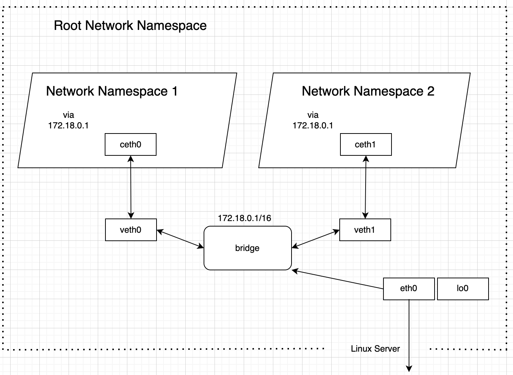
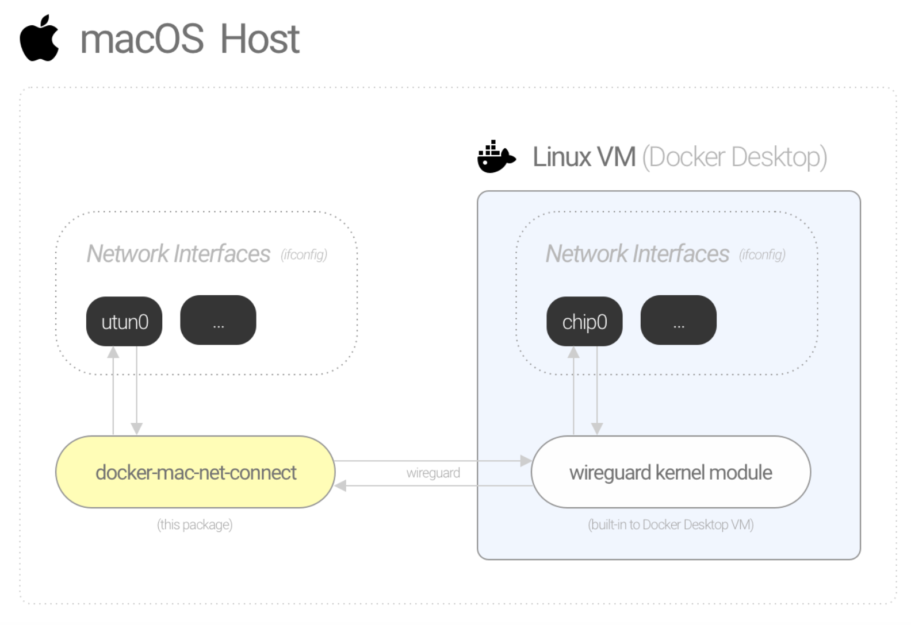
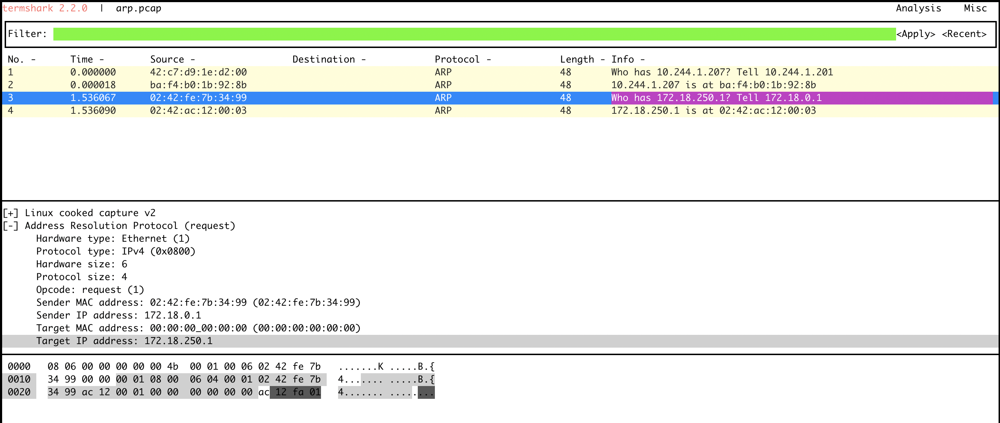
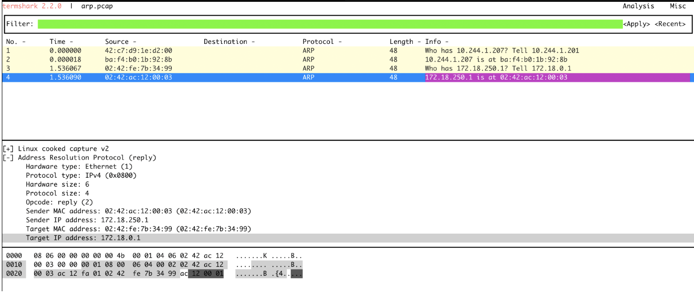

---
authors:
- sara
title: Setting up Load Balancer Service with Cilium in KinD Cluster
date: 2024-05-02
tags:
- Networking
- KinD
- Cilium
- Load Balancer
- MacOS
featureImage: networking.png
---

Kubernetes in Docker (KinD) offers a lightweight and efficient way to run Kubernetes clusters for development and testing purposes. However, setting up KinD with load balancing option requires specific networking configurations. In this article, we'll explore the networking configuration of KinD on both Linux and MacOS, deep dive into load balancing options and discuss troubleshooting tactics.

# Requirements

- [Docker](https://docs.docker.com/engine/install/)
- [KinD](https://kind.sigs.k8s.io/docs/user/quick-start/#installation)
- [Kubectl](https://kubernetes.io/docs/tasks/tools/)
- [Ciliumctl](https://docs.cilium.io/en/stable/gettingstarted/k8s-install-default/)

# Setting Up Kubernetes in Docker

To create a KinD cluster with two nodes, you can use the following configuration:

```yaml
kind: Cluster
apiVersion: kind.x-k8s.io/v1alpha4
networking:
 disableDefaultCNI: true
 kubeProxyMode: none
nodes:
 - role: control-plane
 - role: worker
```

Verify the node status

```
kubectl get nodes
NAME                 STATUS     ROLES           AGE   VERSION
kind-control-plane   NotReady   control-plane   31s   v1.29.2
kind-worker          NotReady   <none>          10s   v1.29.2
```

The nodes are in a 'NotReady' state because the CNI installation is disabled in the KinD config file, where 'disableDefaultCNI' is set to true. This means that the essential networking layer required for pod communication and cluster operation is not configured. Consequently, the kubelet reports a "NotReady" state as it cannot establish network connectivity. Without CNI, pods cannot be assigned IP addresses.

In this article, we are going to use Cilium CNI. Cilium offers advanced networking features, enhanced security, service mesh integration, scalability, and comprehensive observability features. In this article, we’re going to explore some of Cilium advanced networking capabilities.

Deploying Cilium is straightforward, let's simplify things by applying the following configuration:

```
cilium install \
  --set kubeProxyReplacement="strict" \
  --set routingMode="native" \
  --set ipv4NativeRoutingCIDR="10.244.0.0/16" \
  --set k8sServiceHost="kind-control-plane" \
  --set k8sServicePort=6443 \
  --set l2announcements.enabled=true \
  --set l2announcements.leaseDuration="3s" \
  --set l2announcements.leaseRenewDeadline="1s" \
  --set l2announcements.leaseRetryPeriod="500ms" \
  --set devices="{eth0,net0}" \
  --set externalIPs.enabled=true \
  --set autoDirectNodeRoutes=true \
  --set operator.replicas=2
```

Once the configuration is applied, you can verify the status of the Cilium deployment by executing the command `cilium status --wait`. This command will display the live deployment status of various Cilium components. Afterwards, running `kubectl get nodes` will display the nodes in a ready state, confirming the successful setup of networking with Cilium.

Now let's explore network configuration inside the kubernetes cluster:

```
kubectl cluster-info dump | grep -m 1 cluster-cidr
  "--cluster-cidr=10.244.0.0/16",
```

As you can see, the Kubernetes cluster is configured with a cluster CIDR range of 10.244.0.0/16. This CIDR range is used by cilium CNI for assigning IP addresses to pods within the cluster.

The subnets assigned to each node are:

```
kubectl get nodes -o jsonpath='{range .items[*]}{.metadata.name}{"\t"}{.spec.podCIDR}{"\n"}'
kind-control-plane	10.244.0.0/24
kind-worker	        10.244.1.0/24
```

Every node is informed about the IP addresses of all pods on every other node, and corresponding routes are added to the Linux kernel routing table of each node. This config is clearly visible when accessing a node within the cluster. You can do this by running `docker exec -it kind-worker bash` then display the routing table of the node.

```
root@kind-worker:/# ip route
default via 172.18.0.1 dev eth0
10.244.0.0/24 via 172.18.0.3 dev eth0 proto kernel
10.244.1.0/24 via 10.244.1.228 dev cilium_host proto kernel src 10.244.1.228
10.244.1.228 dev cilium_host proto kernel scope link
172.18.0.0/16 dev eth0 proto kernel scope link src 172.18.0.2
```

1. `default via 172.18.0.1 dev eth0`: Any traffic that doesn't match a more specific route in the table will be sent through the gateway with the IP address 172.18.0.1 and the outgoing interface eth0.

2. `10.244.0.0/24 via 172.18.0.3 dev eth0 proto kernel`: Route for the subnet 10.244.0.0/24 (kind-control-plan) should be routed via the gateway with the IP address 172.18.0.3 and the outgoing interface eth0.

3. `10.244.1.0/24 via 10.244.1.228 dev cilium_host proto kernel src 10.244.1.228`: Route for the subnet 10.244.1.0/24 (kind-worker) should be sent via the gateway with the IP address 10.244.1.228 via the interface cilium_host. Additionally, it specifies that the source IP address for this traffic should be 10.244.1.228.

4. `10.244.1.228 dev cilium_host proto kernel scope link`: Network device `cilium_host` with the IP address 10.244.1.228 is directly connected the local network in the container.

# Cilium's Networking options

Cilium represents a modern solution for networking and security in Kubernetes, surpassing the capabilities of traditional components like kube-proxy (disabled in cilium installation  `kubeProxyReplacement="strict"`). While kube-proxy focuses on basic networking tasks such as service discovery and load balancing, Cilium extends its functionality with advanced networking, security, and observability features. 

In terms of load balancing, kube-proxy operates at the network layer (L3/L4) and provides basic load balancing using iptables or IPVS. In contrast, Cilium can handle L3/L4 load balancing and offers more sophisticated techniques. We'll delve into these techniques later in this article.

Cilium offers two network configurations: encapsulation and direct routing (native `routingMode="native"`), each suited to different environments and requirements. Encapsulation works well in cloud environments or situations with overlapping networks while native routing is the best option in on-premises setups or dedicated cloud environments where performance optimization is crucial. 

For further details on this topic, refer to the Cilium documentation: [Cilium Routing Concepts](https://docs.cilium.io/en/stable/network/concepts/routing).

# Network Configuration of KinD Cluster

The architecture of the KinD cluster leverages Docker's networking features alongside standard Kubernetes components. Within a Kind cluster, every Kubernetes node is a Docker container. These containers operate within the same network namespace, facilitating communication via the Docker bridge network. KinD establishes a unique bridge network for each cluster for communication between Kubernetes nodes. Let's explore docker networks.

```
macbook-pro % docker network list
NETWORK ID     NAME      DRIVER    SCOPE
8fd3d395c77e   bridge    bridge    local
457bca38a85e   host      host      local
53ced5328608   kind      bridge    local
c96ad8e9a9bb   none      null      local
```

When examining the network setup, you'll likely identify two bridge networks: `bridge` and `kind`. `bridge` is a system-wide bridge network managed by Docker, used for all Docker containers on the host machine. In contrast, `kind` is specific to each Kind cluster and used exclusively by Kubernetes nodes within that cluster.


```
macbook-pro % docker inspect kind
[
   {
       "Name": "kind",
       "Id": "53ced532860890f57acb0f315561d6af24550e0f052f886f3361bcc0ca94733f",
       "Created": "2024-03-12T16:24:53.318676142Z",
       "Scope": "local",
       "Driver": "bridge",
       "EnableIPv6": true,
       "IPAM": {
           "Driver": "default",
           "Options": {},
           "Config": [
               {
                   "Subnet": "172.18.0.0/16",
                   "Gateway": "172.18.0.1"
               },
               {
                   "Subnet": "fc00:f853:ccd:e793::/64",
                   "Gateway": "fc00:f853:ccd:e793::1"
               }
           ]
       },
       "Internal": false,
       "Attachable": false,
       "Ingress": false,
       "ConfigFrom": {
           "Network": ""
       },
       "ConfigOnly": false,
       "Containers": {
           "006079fd44c64434e818da824356ad71fd80ad05935f88777d1d2d906554ddf5": {
               "Name": "kind-control-plane",
               "EndpointID": "2da48bb2bbeaefdd98e4749777d7401c84d015e076a4b555dc1686ee1014d63d",
               "MacAddress": "02:42:ac:12:00:03",
               "IPv4Address": "172.18.0.3/16",
               "IPv6Address": "fc00:f853:ccd:e793::3/64"
           },
           "6731d2e4298603aa240dab421be84ae0beb1e5c81f27ea59c4097c4844462a82": {
               "Name": "kind-worker",
               "EndpointID": "d3f13cdea8f66fe3c29c2ff159828d977ef88cf7f2974944c11a3b16e18923d9",
               "MacAddress": "02:42:ac:12:00:02",
               "IPv4Address": "172.18.0.2/16",
               "IPv6Address": "fc00:f853:ccd:e793::2/64"
           }
       },
       "Options": {
           "com.docker.network.bridge.enable_ip_masquerade": "true"
       },
       "Labels": {}
   }
]
```

A Linux bridge behaves like a network switch. It forwards packets between interfaces that are connected to it. In the container world, The bridge network functions as a virtual networking interface, interconnecting containers (Linux network namespaces) via virtual Ethernet pairs (veth pairs). Each container is configured with its own veth pair, with one end connected to the bridge network. This arrangement enables communication between containers internally and with the host system.

Linux Namespaces play a pivotal role in containerization by providing isolated environments for individual containers. Each Docker container is encapsulated within its own namespace, ensuring it has its distinct IP address, routing table, and network configuration. This isolation mechanism prevents interference between containers and ensures the host system's integrity. (check our next article for more details about linux network namespace technologie in container's world)



Now, let's attempt to ping one of the node IPs. Remember, in a KinD cluster, nodes are Docker containers. 
If you're using a Linux-based OS, the ping will be successful. However, if you're on macOS, you'll observe:

```
macbook-pro % ping 172.18.0.2
PING 172.18.0.2 (172.18.0.2): 56 data bytes
Request timeout for icmp_seq 0
Request timeout for icmp_seq 1
Request timeout for icmp_seq 2
```

The ping is timing out!

# Container's Networking on MacOS

In macOS, Docker-for-Mac doesn't directly expose container networks on the host system. Instead, it operates by running a Linux VM in the background and launches containers within that VM. It enables connections to containers via port binding (L4) and doesn't support connections by IP address (L3).

Let's explore the routing table in the MacOS host:

```
macbook-pro % netstat -rn
Routing tables

Internet:
Destination        Gateway            Flags           Netif Expire
default            192.168.1.1        UGScg             en0
default            link#17            UCSIg       bridge100      !
10.33.33.2         10.33.33.1         UH              utun0
127                127.0.0.1          UCS               lo0
127.0.0.1          127.0.0.1          UH                lo0
169.254            link#6             UCS               en0      !
192.168.1          link#6             UCS               en0      !
192.168.1.1/32     link#6             UCS               en0      !
192.168.1.1        84:90:a:3e:a2:4    UHLWIir           en0   1126
192.168.1.10/32    link#6             UCS               en0      !
192.168.1.11       80:c:f9:6b:68:84   UHLWI             en0   1100
192.168.64         link#17            UC          bridge100      !
192.168.64.1       16.7d.da.9a.15.64  UHLWI             lo0
192.168.64.3       6.c5.4b.b4.32.aa   UHLWIi      bridge100    248
224.0.0/4          link#6             UmCS              en0      !
224.0.0.251        1:0:5e:0:0:fb      UHmLWI            en0
224.0.0.251        1:0:5e:0:0:fb      UHmLWIg     bridge100
239.255.255.250    1:0:5e:7f:ff:fa    UHmLWI            en0
255.255.255.255/32 link#6             UCS               en0      !
```

As evident, there's no network configuration to access the Docker network within the Docker Desktop VM. By contrast, comparing this with the Linux host's `ip route` output reveals significant configuration differences.

```
root@ubuntu # ip route
default via 192.168.64.1 dev enp0s1 proto dhcp src 192.168.64.3 metric 100
172.17.0.0/16 dev docker0 proto kernel scope link src 172.17.0.1 linkdown
172.18.0.0/16 dev br-38055463db3c proto kernel scope link src 172.18.0.1
192.168.64.0/24 dev enp0s1 proto kernel scope link src 192.168.64.3 metric 100
192.168.64.1 dev enp0s1 proto dhcp scope link src 192.168.64.3 metric 100
```

Here, we can see a route to the container's subnet via the network interface `br-38055463db3c`. The `172.18.0.0/16 dev br-38055463db3c proto kernel scope link src 172.18.0.1` line in the routing table indicates that the IP address range `172.18.0.0/16` is associated with the network device `br-38055463db3c`, which is the bridge interface.

Now let’s list the network interfaces in the Linux host:

```
root@ubuntu # ip link 
…
4: br-38055463db3c: <BROADCAST,MULTICAST,UP,LOWER_UP> mtu 1500 qdisc noqueue state UP mode DEFAULT group default 
    link/ether 02:42:c4:e4:5f:7e brd ff:ff:ff:ff:ff:ff
6: vethf413b4a@if5: <BROADCAST,MULTICAST,UP,LOWER_UP> mtu 1500 qdisc noqueue master br-38055463db3c state UP mode DEFAULT group default 
    link/ether 0a:86:ac:2a:fe:a5 brd ff:ff:ff:ff:ff:ff link-netnsid 1
8: vethb9242a9@if7: <BROADCAST,MULTICAST,UP,LOWER_UP> mtu 1500 qdisc noqueue master br-38055463db3c state UP mode DEFAULT group default 
    link/ether a2:11:09:57:4f:26 brd ff:ff:ff:ff:ff:ff link-netnsid 0
…
```

Let’s break down the configuration:

**br-38055463db3c**: The bridge interface.

**vethf413b4a@if5**: This is a virtual Ethernet interface (veth) named "vethf413b4a" It is paired with another veth interface in a network namespace (container). It is connected to the bridge interface "br-38055463db3c", this represents the link between the container and bridge  discussed previously.

**vethb9242a9@if7**: Similar to the second interface, this is another veth interface named "vethb9242a9". It is paired with another veth interface in a network namespace (container). Also connected to the same bridge interface "br-38055463db3c".

This means the docker containers are linked to the host via the bridge network. You can observe the traffic going in/out of the containers by running `tcpdump -i vethf413b4a` and `tcpdump -i vethb9242a9` from your local host.

To achieve similar connectivity on macOS host, we are going to use [docker mac net connect](https://github.com/chipmk/docker-mac-net-connect?tab=readme-ov-file#installation). This tool establishes a basic network tunnel between macOS and the Docker Desktop Linux VM. `docker-mac-net-connect` creates a virtual network interface (`utun`), acting as the bridge between your Mac and the Docker Desktop Linux VM.



```bash
brew install chipmk/tap/docker-mac-net-connect
sudo brew services start chipmk/tap/docker-mac-net-connect
```

Check the routing table again.

```
macbook-pro % netstat -rn
Routing tables

Internet:
Destination        Gateway            Flags           Netif Expire
default            192.168.1.1        UGScg             en0
default            link#17            UCSIg       bridge100      !
10.33.33.2         10.33.33.1         UH              utun0
127                127.0.0.1          UCS               lo0
127.0.0.1          127.0.0.1          UH                lo0
169.254            link#6             UCS               en0      !
172.17             utun0              USc             utun0
172.18             utun0              USc             utun0
192.168.1          link#6             UCS               en0      !
192.168.1.1/32     link#6             UCS               en0      !
192.168.1.1        84:90:a:3e:a2:4    UHLWIir           en0   1126
192.168.1.10/32    link#6             UCS               en0      !
192.168.1.11       80:c:f9:6b:68:84   UHLWI             en0   1100
192.168.64         link#17            UC          bridge100      !
192.168.64.1       16.7d.da.9a.15.64  UHLWI             lo0
192.168.64.3       6.c5.4b.b4.32.aa   UHLWIi      bridge100    248
224.0.0/4          link#6             UmCS              en0      !
224.0.0.251        1:0:5e:0:0:fb      UHmLWI            en0
224.0.0.251        1:0:5e:0:0:fb      UHmLWIg     bridge100
239.255.255.250    1:0:5e:7f:ff:fa    UHmLWI            en0
255.255.255.255/32 link#6             UCS               en0      !

```

Now, multiple routes have been added to the routing table. `172.18             utun0              USc             utun0` indicates that to access the subnet 172.18/16 (the docker network), the traffic should go through the network interface `utun0`. This network interface is connected on the other side of the tunnel to the Docker VM.

The other end of the tunnel (docker VM) is configured by a one-time container with sufficient privileges to configure the Linux host’s network interfaces. The container creates the interface, then exits. Despite the container's termination, the VM interface continues to function because it was created within the Linux host’s network namespace.

With these configurations in place, the ping command will function once again, indicating that we now have access to the Docker's network from the macOS host.

```
macbook-pro % ping 172.18.0.2
PING 172.18.0.2 (172.18.0.2): 56 data bytes
Request timeout for icmp_seq 0
Request timeout for icmp_seq 1
Request timeout for icmp_seq 2
...
Request timeout for icmp_seq 20
64 bytes from 172.18.0.2: icmp_seq=21 ttl=63 time=3.334 ms
64 bytes from 172.18.0.2: icmp_seq=22 ttl=63 time=1.118 ms
64 bytes from 172.18.0.2: icmp_seq=23 ttl=63 time=1.016 ms
```

# Implementing Load Balancer service in KinD cluster with Cilium

To enable north/south traffic in your home lab, deploying a load balancer is a straightforward option. Cilium provides a load balancer feature that allows for load balancing in bare-metal Kubernetes setups. Announcing the load balancer IP to the network is crucial for proper traffic routing, which can be achieved through BGP or L2 routing.

*BGP*: BGP stands as a dynamic routing protocol widely utilized in operational Kubernetes environments to broadcast external IP addresses. While its setup may hide greater complexity, BGP brings scalability and resilience through dynamic routing.

*L2 Layer*: Alternatively, announcing the LB IP at the L2 layer simplifies the configuration process but may compromise the flexibility and scalability offered by BGP. This method suits smaller, less intricate deployments where simplicity takes precedence.

Within our home lab setup, we'll use Cilium's advanced networking features; LB-IPAM alongside L2 announcements. LB-IPAM handles the assignment of IP addresses to services of type LoadBalancer, while L2 announcements ensure services become visible and accessible across the local area network (L2 network).

Now let's deploy a simple Kubernetes service of type load balancer:

```yaml
apiVersion: v1
kind: Service
metadata:
name: sampleservice
spec:
type: LoadBalancer
ports:
- port: 80
selector:
  app: myapp
---
apiVersion: apps/v1
kind: Deployment
metadata:
name: sampleapp
spec:
selector:
  matchLabels:
    app: myapp
replicas: 1
template:
  metadata:
    labels:
      app: myapp
  spec:
    containers:
    - name: myserver
      image: nginx
      imagePullPolicy: IfNotPresent
```

Check the status of the service:

```
macbook-pro % kubectl get svc
NAME            TYPE           CLUSTER-IP    EXTERNAL-IP   PORT(S)        AGE
kubernetes      ClusterIP      10.96.0.1     <none>        443/TCP        5h30m
sampleservice   LoadBalancer   10.96.28.96   <pending>     80:31508/TCP   4h53m
```

As evident, the service is created with a pending external IP. To initiate IP assignment for the service load balancer, we need to deploy an lb-ipam pool. This pool defines the IP range from which cilium can select an IP address for the service.

```yaml
apiVersion: "cilium.io/v2alpha1"
kind: CiliumLoadBalancerIPPool
metadata:
name: "lb-pool-1"
spec:
cidrs:
  - cidr: "172.18.250.0/24"
  ```

Now let's check the service again:

```
macbook-pro % kubectl get svc
NAME            TYPE           CLUSTER-IP    EXTERNAL-IP    PORT(S)        AGE
kubernetes      ClusterIP      10.96.0.1     <none>         443/TCP        5h32m
sampleservice   LoadBalancer   10.96.28.96   172.18.250.1   80:31508/TCP   4h56m
```

The external IP has now been allocated to the service from the LB-IPAM pool. To implement advanced filtering on the pool, such as service selectors, please consult the documentation [here](https://docs.cilium.io/en/stable/network/lb-ipam/#service-selectors).

Once the IP has been assigned, we should be able to broadcast it locally (to all other devices sharing the same physical network L2). To achieve this, we need to create a cilium announcement policy.

```yaml
apiVersion: "cilium.io/v2alpha1"
kind: CiliumL2AnnouncementPolicy
metadata:
name: announcement-policy-1
spec:
externalIPs: false
loadBalancerIPs: true
interfaces:
- ^eth[0-9]+
nodeSelector:
  matchExpressions:
    - key: node-role.kubernetes.io/control-plane
      operator: DoesNotExist
```

The "interfaces" field specifies the network interfaces over which the chosen services will be broadcast. This field is optional, if left unspecified, all interfaces will be utilized. It's essential to note that L2 announcements will function only if the selected devices are included in the 'devices' set specified in the field 'devices="{eth0,net0}"'.

L2 announcement functions are based on the Address Resolution Protocol (ARP). ARP is a fundamental protocol in computer networks used to map IP addresses to MAC addresses. Here's a breakdown of ARP's operation when trying to access Kubernetes load balancer service “curl 172.18.250.1/” from the local computer:

1. ARP Process Begins: The local computer checks its ARP cache to see if it has the MAC address of the destination IP address (docker container). If not found, an ARP request process begins.

2. ARP Request Packet Creation: The local computer constructs an ARP request packet containing the IP address of the destination (the LoadBalancer IP) and its own MAC address. The destination MAC address in the ARP request packet is set to the broadcast MAC address (FF:FF:FF:FF:FF:FF) to ensure all devices on the local network receive it.

3. ARP Request Broadcast: The local computer sends the ARP request packet as a broadcast frame onto the local network segment (L2 network). All devices on the local network receive this ARP request.

4. Cilium Agent Responds: after receiving the ARP request by the Kubernetes nodes, the Cilium agent checks if it has the specified IP address. If found, it responds with an ARP reply packet containing the MAC address of the node (in this case, the Docker container's IP).

5. ARP Reply Packet: The ARP reply packet is sent directly to the MAC address of the local computer that initiated the ARP request.

6. ARP Cache Update: The local computer receives the ARP reply packet, extracts the MAC address of the LoadBalancer, and updates its ARP cache with this mapping. This mapping is cached for future use to avoid sending ARP requests for the same IP address.

The ARP table contains only the most recent MAC address associated with an IP. As a result, only one node in the cluster can reply to requests for a specific IP address. To ensure this, each Cilium agent selects services for its node and participates in leader election using [Kubernetes leases](https://kubernetes.io/docs/concepts/architecture/leases/). Every service corresponds to a lease, and the lease holder is responsible for responding to requests on designated interfaces.

```
kubectl get leases -n kube-system
NAME                                       HOLDER                       AGE
…
cilium-l2announce-default-sampleservice     kind-worker                 4m2s
…
```

Now notice that the lease cilium-l2announce-default-sampleservice has elected kind-worker as a leader, in this case the cilium agent in this node will help in the ARP resolution process. Let's capture the ARP traffic arriving at the kind-worker node using tcpdump.

```bash
CILIUM_POD=$(kubectl -n kube-system get pod -l k8s-app=cilium --field-selector spec.nodeName=kind-worker  -o name)

kubectl -n kube-system exec -ti $CILIUM_POD -- bash

apt-get update && DEBIAN_FRONTEND=noninteractive apt-get -y install tcpdump termshark

tcpdump -i any arp -w arp.pcap
```

Now, open another terminal and run curl command with the Load Balancer IP address.

```bash
curl 172.18.250.1/
```

You'll notice that the curl request is successful.
Go back now to the Cilium agent terminal and stop the running command. Next, open Termshark and load the ARP file to examine the results.

```bash
TERM=xterm-256color termshark -r arp.pcap
```





In both screenshots we can see the ARP request and reply details provide insights into how network devices communicate and resolve MAC addresses to IP addresses. Here's an explanation of each component:

ARP Request (1st screenshot):
Sender's IP Address: The IP address of the device sending the ARP request.
Sender's MAC Address: The MAC address of the device sending the ARP request.
Target IP Address: The IP address for which the MAC address is being requested.
Target MAC Address: This field is typically set to all zeros in ARP requests since the sender is asking for the MAC address associated with a specific IP address. It's often referred to as the "broadcast MAC address" (FF:FF:FF:FF:FF:FF).

ARP Reply (2nd screenshot):
Sender's IP Address: The IP address of the device sending the ARP reply.
Sender's MAC Address: The MAC address of the device sending the ARP reply.
Target IP Address: The IP address for which the MAC address is being provided.
Target MAC Address: The MAC address associated with the target IP address, as requested in the ARP request.

# Conclusion

Setting up the networking and load balancing in a KinD cluster with Cilium involves careful configuration and troubleshooting. By understanding the underlying principles and employing the right tools and techniques, you can ensure smooth operation and optimal performance of your home lab environment.

Check our labs here https://github.com/fence-io/playground?tab=readme-ov-file#available-labs