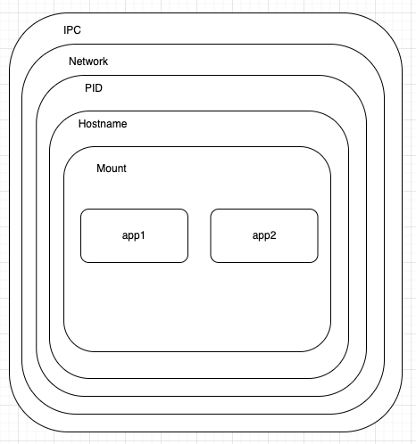
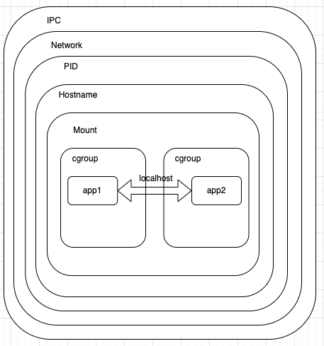
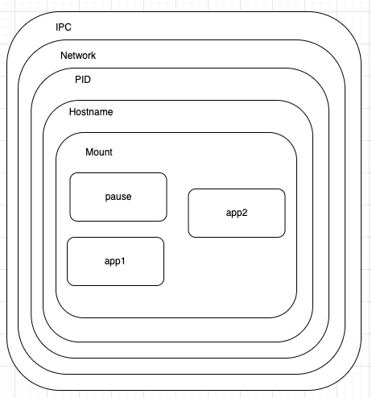
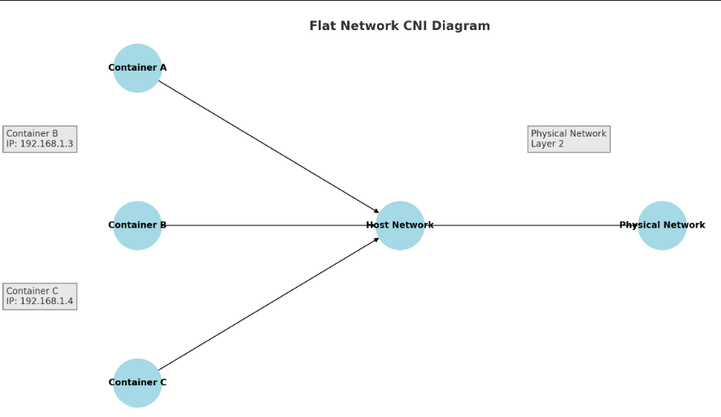
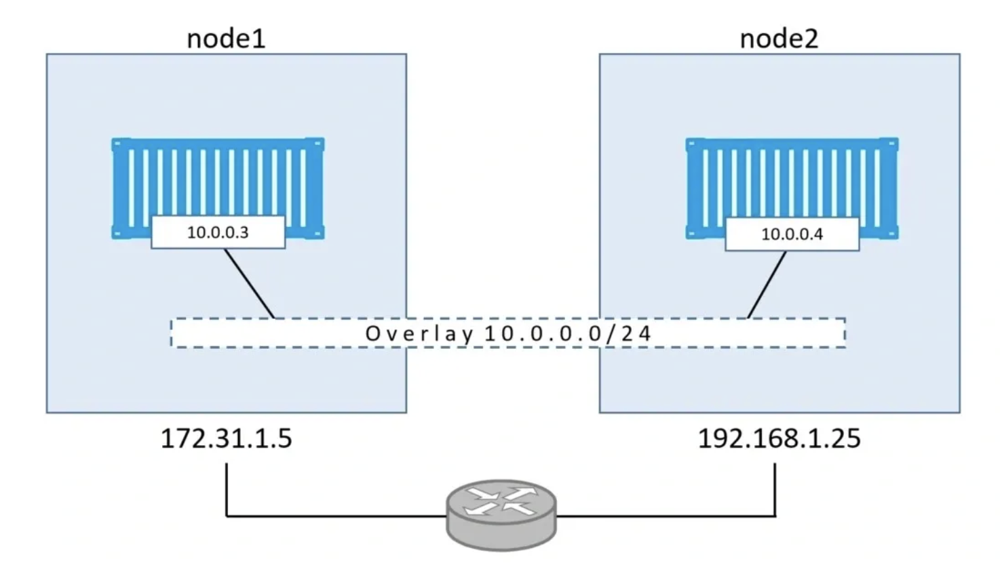
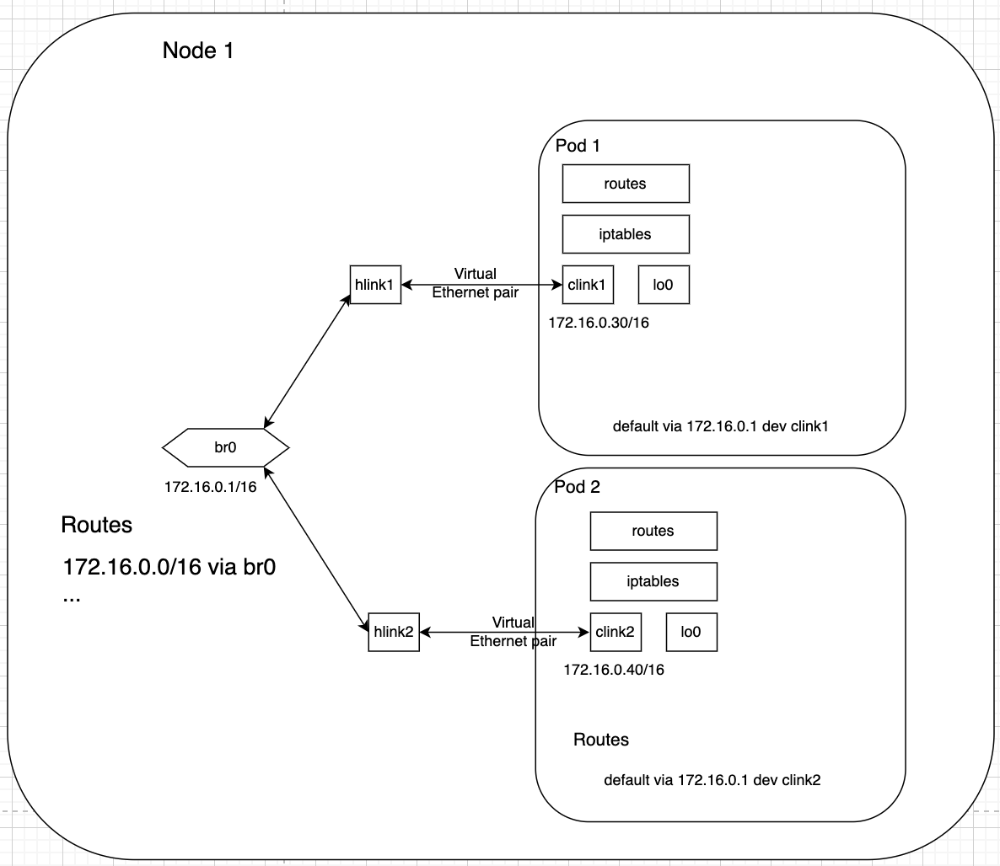
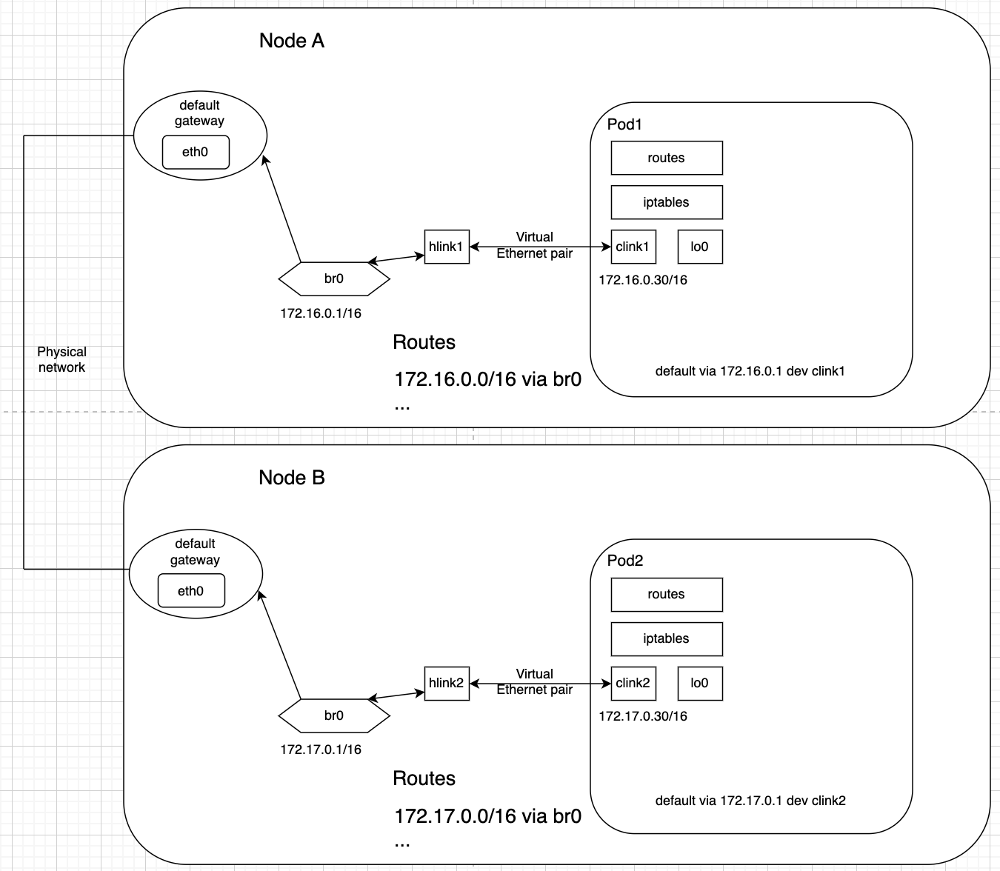
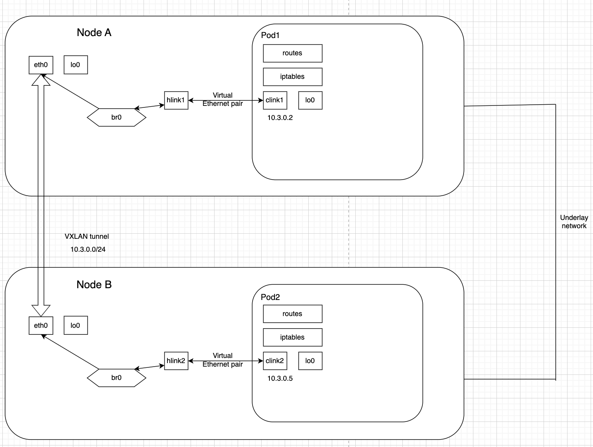
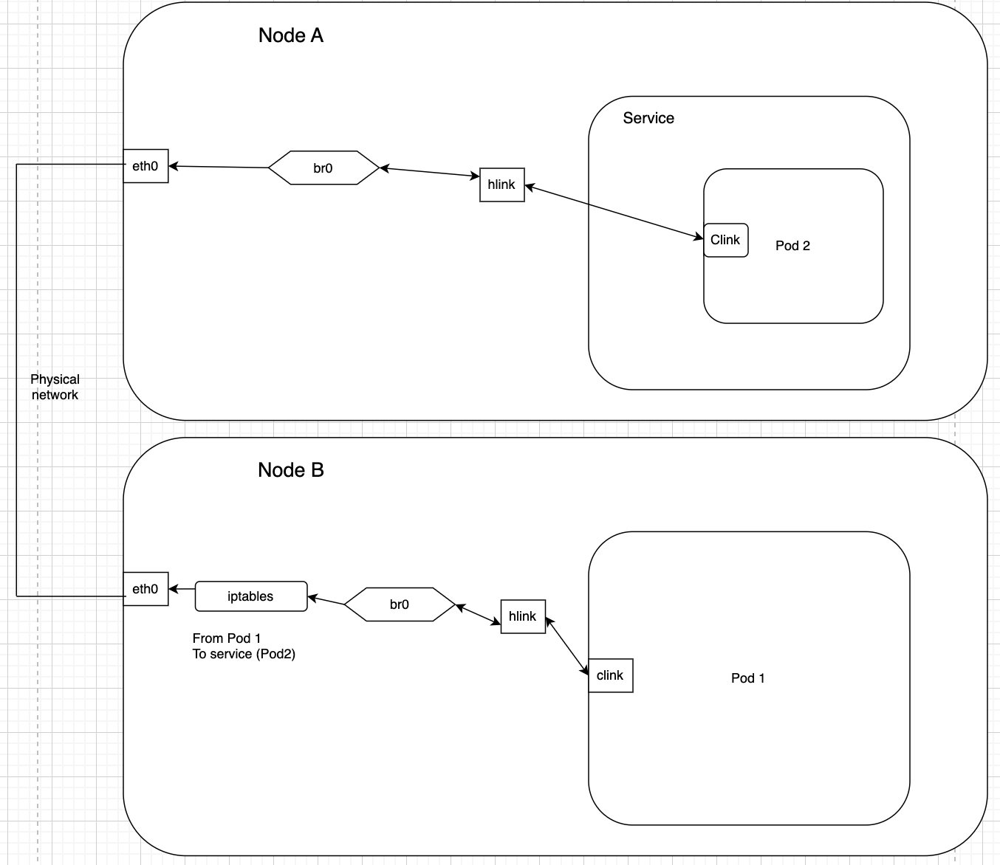

---
authors:
- sara
title: Decoding Kubernetes Pod Creation and Network Traffic Management
date: 2024-05-24
tags:
- Kubernetes
- Networking
- Container
- CNI
images:
- kube-linux.png
codespace: https://codespaces.new/fence-io/playground
slug: "kubernetes-Networking"
series: 
- Networking
series_order: 3
series_opened: true
---

This article delves into the underlying processes involved in creating a pod and traces the path of network traffic within a Kubernetes cluster, from an initial web request to the container hosting the application. We will explore:

- What steps involved in the pod creation
- How containers communicate locally (Intra-Pod communication).
- Pod-to-Pod communication when the pods are on the same and different nodes.
- Pod-to-Service communication, where a pod sends traffic to another pod behind a service in Kubernetes.

# Requirements

- Read [Diving deep into Container Networking](https://fence-io.github.io/website/articles/networking/diving-deep-into-container-networking/)
- [Docker](https://docs.docker.com/engine/install/)
- [KinD](https://kind.sigs.k8s.io/docs/user/quick-start/#installation)
- [Kubectl](https://kubernetes.io/docs/tasks/tools/)
- Linux host system

# What Happens When Creating a Pod

A Pod is the smallest deployable unit in Kubernetes, encapsulating one or more containers. It utilizes two powerful Linux features, [Linux namespaces](https://man7.org/linux/man-pages/man7/namespaces.7.html) and [cgroups](https://man7.org/linux/man-pages/man7/cgroups.7.html) for isolation and resource management.

## Linux Namespaces

According to the man page:

    ' A namespace wraps a global system resource in an abstraction that
       makes it appear to the processes within the namespace that they
       have their own isolated instance of the global resource'


Put simply, namespaces isolate processes, making them appear to have their own private instances, with changes visible only within the same namespace. In the Linux kernel, various types of namespaces exist, each with distinct properties.

- **User Namespace**: Isolates user and group IDs. A process can have root privileges within its user namespace without having root privileges in other namespaces.
- **PID Namespace**: Provides an independent set of process IDs. The first process in a new namespace gets PID 1, similar to the init process.
- **Network Namespace**: Isolates the network stack, including routing tables, IP addresses, sockets, and firewall rules (as discussed previously [here](https://fence-io.github.io/website/articles/networking/diving-deep-into-container-networking/))
- **Mount Namespace**: Isolates the list of mount points. Filesystems can be mounted/unmounted within this namespace without affecting the host filesystem.
- **IPC Namespace**: Isolates inter-process communication resources like message queues and shared memory.
- **UTS Namespace**: Isolates hostname and domain name.

## Cgroups

Cgroups (control groups) limit the resources that a process can use, including CPU, memory, and I/O. In the context of containers, the container runtime continually monitors the resource usage of the container via cgroups. 

If a container exceeds its limits, cgroups can enforce the constraints by throttling or killing the processes within the container.

## Steps in Pod Creation

Creating a pod in Kubernetes involves several detailed steps, from high-level orchestration down to low-level OS operations:

The API server authenticates the user, authorizes the request, validates the pod specification, and writes it to etcd. The scheduler then assigns the pod to a node, and the Kubelet on that node detects the new assignment and begins creating the pod.

### Isolation

The Kubelet interacts with the container runtime to create the containers defined in the pod. The container runtime pulls the required images and sets up namespaces for resource isolation.



You can visualize the Linux namespaces on a Kubernetes node by running `lsns`, which lists all namespaces created for containers on the host and provides the PIDs of the processes running in each namespace. To see the namespaces for a specific container, use its PID and run:

```
root@kind-control-plane:/# ls /proc/PID/ns
cgroup	ipc  mnt  net  pid  pid_for_children  time  time_for_children  user  uts
```

OR

```
root@kind-control-plane:/# lsns -p PID
        NS TYPE   NPROCS   PID USER  COMMAND
4026531834 time       25     1 root  /sbin/init
4026531837 user       25     1 root  /sbin/init
4026532674 uts        25     1 root  /sbin/init
4026532677 net        24     1 root  /sbin/init
4026532812 ipc         2   336 65535 /pause
4026532820 mnt         1   439 root  kube-apiserver --advertise-address=172.18.0.2 --allow-privileged=true --authorization-mode=Node
4026532821 pid         1   439 root  kube-apiserver --advertise-address=172.18.0.2 --allow-privileged=true --authorization-mode=Node
4026532822 cgroup      1   439 root  kube-apiserver --advertise-address=172.18.0.2 --allow-privileged=true --authorization-mode=Node

```

### Resource Management

When deploying a pod, you can specify resource limits and requests in the pod specification. Kubernetes communicates these specifications to the container runtime, which configures cgroups accordingly to enforce these resource constraints.

- **CPU Limits**: cgroups can limit the amount of CPU time a container can use. For example, you can specify that a container can only use 50% of a single CPU core:

  ```
  echo "512" > /sys/fs/cgroup/cpu/my_container/cpu.shares
  ```

- **Memory Limits**: cgroups can limit the amount of memory a container can use. If a container tries to use more memory than allocated, it can be killed or throttled:

  ```
  echo "500M" > /sys/fs/cgroup/memory/my_container/memory.limit_in_bytes
  ```

- **I/O Limits**: cgroups can limit the read and write speeds of devices associated with the container:

  ```
  echo "8:16 1024" > /sys/fs/cgroup/blkio/my_container/blkio.throttle.read_bps_device
  ```



### Pause container ?

When checking the nodes of your Kubernetes cluster, you may notice some containers named "pause" when you run `docker ps` on the node. The pause container is a minimal container used as the parent for other containers in a Pod and serves several crucial roles.

The pause container is the first to start when a Pod is created, setting up the shared namespace environment for the other containers and then remaining running while consuming minimal resources.

It holds the network namespace and other shared namespaces (such as PID, IPC, and UTS) for the Pod. By maintaining these namespaces, the pause container ensures that all containers in the Pod can be restarted independently without losing the network setup or other shared resources.



Without the pause container, each time a container crashes inside the Pod, the CNI would need to reconfigure the network and go through all the steps previously listed, which would disrupt the service.


# Assigning IP to Pod

When a pod is assigned to a node, 

The kubelet interacts with the container runtime through the CRI to create the container. 

As part of the container creation process, the CRI runtime triggers the CNI plugin to set up networking for the container. The CNI plugin provid the necessary networking configuration, including the network namespace of the container.

- The CNI plugin configures the network interface inside the container’s network namespace.
- The plugin allocates an IP address to the container.
- The plugin sets up routing rules and connects the container to the appropriate network (by configuring a bridge, VXLAN, etc.).
- The CRI runtime sets up DNS resolution inside the container.
- The pod registers with the cluster DNS.

Once the CNI plugin has successfully set up networking, it returns the network configuration (e.g., the assigned IP address) to the CRI runtime. The CRI runtime passes this information back to the kubelet. The kubelet completes the pod creation process, and the pod becomes ready with its network fully configured.

## Comparing CNIs

CNI plugins manage the creation, management, and deletion of network interfaces in containers, enabling communication both within the same host and across different hosts.

There are two main types of CNIs: flat networks and overlay networks.

**Flat Network CNI**: 

Connects containers directly to a physical network, making them appear as if they are on the same layer 2 network. This method involves minimal network overlay, with containers using IP addresses from the node pool.



Advantages:

- Simplicity: Easier to understand and troubleshoot compared to more complex network setups like overlays.
- Performance: Potentially lower latency and overhead since there’s no need for encapsulation or additional routing.

Disadvantages:

- Scalability: Limited by the size of the subnet, making it less suitable for large clusters.
- IP Management: Requires diligent management of IP addresses to prevent conflicts and ensure sufficient addresses for all pods.

Some common CNI plugins that can support flat network configurations include [Cilium in native mode](https://docs.cilium.io/en/stable/network/concepts/routing/#native-routing).

**Overlay Network CNI**: 

Abstracts the physical network by creating a virtual network layer, encapsulating container traffic within tunnels (e.g., VXLAN). This provides strong isolation between network segments.



Advantages:

- Scalability: Can support large clusters by isolating pod IPs from the underlying physical network.
- Network Isolation: Provides better isolation and security between different network segments or tenants.
- Flexibility: Allows for more complex networking setups, including multi-tenancy and cross-datacenter connectivity.

Disadvantages:

- Performance Overhead: Encapsulation can introduce additional latency and CPU overhead due to the processing required.
- Complexity: More complex to configure, troubleshoot, and manage compared to flat networks.

Some popular CNI plugins that support overlay networks include [Cilium in encapsulation mode](https://docs.cilium.io/en/stable/network/concepts/routing/#encapsulation).

# Pod-to-Pod Communication

When pods are on the same node, they communicate through the host's network bridge at Layer 2 (L2) of the OSI model. See previews [article](https://fence-io.github.io/website/articles/networking/diving-deep-into-container-networking/).

**Network Bridge**: 
   - Each node in Kubernetes has a network bridge that acts as a virtual switch, connecting all the pods on that node.
   - Pods on the same node have virtual Ethernet interfaces connected to this bridge.
   - When a pod sends a packet to another pod on the same node, the packet is sent to the network bridge, which then forwards it to the destination pod without leaving the node.
   
The communication happens directly at the Ethernet frame level, making it very fast and efficient. No IP routing is involved, which reduces overhead and latency.

**Example**:



   - Pod 1 (IP: 172.16.0.30) sends a packet to Pod 2 (IP: 172.16.0.40) on the same node.
   - The packet is sent to the network bridge, which forwards it directly to Pod 2 based on its MAC address.

When pods are on different nodes, they communicate via Layer 3 routing, involving default gateways and potentially an overlay network.

**Default Gateway**:

Each node has a default gateway, typically managed by the node's network interface (often eth0).

When a pod needs to communicate with another pod on a different node, it sends the packet to its default gateway.

The packet is encapsulated (if using an overlay network like VXLAN, the original packet is wrapped in another packet with a new header) and routed across the physical network infrastructure to the destination node.

The destination node's gateway decapsulates the packet (removing the outer header and exposing the original packet) and forwards it to the appropriate pod.

**Example**:



   - Pod 1 on Node A (IP: 172.16.0.30) wants to communicate with Pod 2 on Node B (IP: 172.17.0.30).
   - Pod 1 sends the packet to its default gateway, which encapsulates the packet and routes it through the physical network to Node B.
   - Node B's gateway decapsulates the packet and forwards it to Pod 2.

**Overlay Network (if used)**:

An overlay network abstracts the physical network, allowing pods to communicate across different nodes as if they are on the same network.

Technologies like VXLAN encapsulate the pod's traffic, providing a virtual Layer 2 network on top of the Layer 3 physical network.




# Pod-to-Services

In Kubernetes, services provide a stable IP address and DNS name for a set of pods, allowing clients to reliably communicate with the pods regardless of their IP addresses. Here’s how pod-to-service communication works:

**Kubernetes Services**

When a service is created, Kubernetes assigns it a stable IP address (ClusterIP) and, optionally, an external IP address.

Services use selectors to match the pods that should receive traffic. 

Kubernetes automatically creates endpoint objects for a service, which track the IP addresses and ports of the pods that match the service’s selectors.

**Networking Components**

Kubernetes services rely on two essential networking components:

   - [`netfilter`](https://www.netfilter.org/projects/nftables/manpage.html) is a framework within the Linux kernel that performs various network-related operations, including packet filtering, NAT (Network Address Translation), and port forwarding.
   - [`iptables`](https://ipset.netfilter.org/iptables.man.html) is a user-space utility program that allows administrators to configure the `netfilter` tables with rules for how packets should be handled.

**Pod-to-Service Communication**



The `pod1` initiates a request to the service's ClusterIP.

Upon reaching the node's network stack (node B), `iptables` rules come into play. Kubernetes configures several `iptables` chains to manage service traffic, primarily within the `nat` table under chains like `KUBE-SERVICES` and `KUBE-POSTROUTING`.

```
root@kind-worker:/# iptables -t nat --list 
...
Chain POSTROUTING (policy ACCEPT)
target     prot opt source               destination         
KUBE-POSTROUTING  all  --  anywhere             anywhere             /* kubernetes postrouting rules */
DOCKER_POSTROUTING  all  --  anywhere             ubuntu              
KIND-MASQ-AGENT  all  --  anywhere             anywhere             ADDRTYPE match dst-type !LOCAL /* kind-masq-agent: ensure nat POSTROUTING directs all non-LOCAL destination traffic to our custom KIND-MASQ-AGENT chain */
...
Chain KUBE-SERVICES (2 references)
target     prot opt source               destination         
KUBE-SVC-JD5MR3NA4I4DYORP  tcp  --  anywhere             10.96.0.10           /* kube-system/kube-dns:metrics cluster IP */ tcp dpt:9153
KUBE-SVC-S6WXVSJHNSEXRU24  tcp  --  anywhere             10.96.254.54         /* default/sampleservice cluster IP */ tcp dpt:http
KUBE-SVC-NPX46M4PTMTKRN6Y  tcp  --  anywhere             10.96.0.1            /* default/kubernetes:https cluster IP */ tcp dpt:https
KUBE-SVC-TCOU7JCQXEZGVUNU  udp  --  anywhere             10.96.0.10           /* kube-system/kube-dns:dns cluster IP */ udp dpt:domain
KUBE-SVC-ERIFXISQEP7F7OF4  tcp  --  anywhere             10.96.0.10           /* kube-system/kube-dns:dns-tcp cluster IP */ tcp dpt:domain
KUBE-NODEPORTS  all  --  anywhere             anywhere             /* kubernetes service nodeports; NOTE: this must be the last rule in this chain */ ADDRTYPE match dst-type LOCAL

```

Utilizing DNAT, `iptables` translates the service's ClusterIP and port to one of the service's endpoints (pod IP and port) in a round-robin fashion.

This translation is executed via `KUBE-SVC-<ServiceHash>` chains, with each service having a unique hash and a corresponding chain in `iptables`.

```
root@kind-worker:/# iptables -t nat --list 
...
Chain KUBE-SVC-S6WXVSJHNSEXRU24 (2 references)
target     prot opt source               destination         
KUBE-MARK-MASQ  tcp  -- !10.244.0.0/16        10.96.254.54         /* default/sampleservice cluster IP */ tcp dpt:http
KUBE-SEP-QOULV7SDHVBTRDDQ  all  --  anywhere             anywhere             /* default/sampleservice -> 10.244.1.2:80 */
...
```

The `netfilter` framework processes the packet based on the `iptables` rules, executing the necessary NAT operations to modify the packet’s destination IP and port. The packet is then directed towards the appropriate pod IP.

The modified packet arrives at the destination pod, which processes the request and generates a response.

The response packet travels back to the client pod, potentially undergoing SNAT (Source NAT) by `iptables` to ensure the packet appears to originate from the service IP, thus maintaining transparency for the client pod.


# Conclusion

This detailed exploration of the steps and interactions involved in pod creation and network traffic in Kubernetes highlights the intricate orchestration that ensures efficient, secure, and isolated container operations. Understanding these processes provides insight into Kubernetes' powerful container management capabilities.