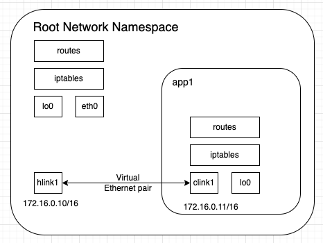
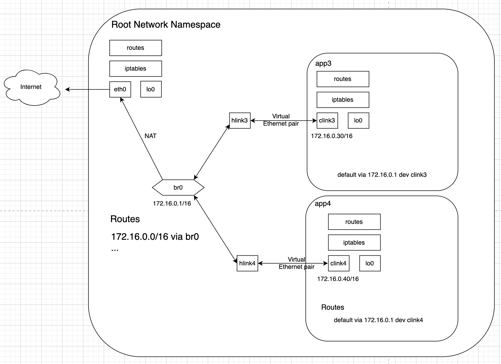

---
authors:
- sara
title: Diving deep into Container Networking (An Exploration of Linux Network Namespace)
date: 2024-05-09
tags:
- Networking
- Container
- Linux
- Bridge
images:
- bridge.png
codespace: https://codespaces.new/fence-io/playground
slug: "Diving-deep-into-Container-Networking"
series: 
- Networking
series_order: 2
series_opened: true
---

# Introduction

Container networking might seem complex and almost mystical initially, but it's actually built on basic Linux networking principles. By understanding these fundamentals, we can troubleshoot the container networking layers on a profound level. Furthermore, we might even create container networking solution from scratch for pure enjoyment.

In this article we are going to cover the foundational elements of container networking, from the underlying principles of network namespaces to the practical tools and techniques for managing container networking environments.

# Requirements 

For this article, you'll require a Linux host system equipped with the following tools: `nsenter`, `ping`, and `tcpdump`. 

# Dive Into The Foundations of Container Networking

A container is essentially, an isolated and restricted Linux process within its own networking context that is completely separate from both the host system and other containers.

At the heart of this isolation lies a fascinating Linux kernel feature known as network namespaces. According to the man page, "network namespace is logically another copy of the network stack, with its own routes, firewall rules, and network devices.". 

Essentially, it allows processes to operate within their own distinct network environment, including having their own network interfaces, routing tables, and firewall configurations.

This capability of Linux kernel empowers containerization technologies like Docker. By placing containers within their own network namespaces, they gain autonomy over their network configurations and ensures that containers can communicate with each other or the external network without causing interference with other containers or the host system's network setup (root namespace).

To unravel this concept, let's delve into some fundamental aspects.

## What constitutes a Networking Stack?

The networking stack is a set of software layers designed to facilitate communication across networks. Each layer within this stack is responsible for specific tasks such as data transmission, addressing, routing, and interaction with applications. Together, these layers collaborate to establish communication between devices connected to a network. This networking stack typically follows the OSI (Open Systems Interconnection) model.

Here's a overview of the layers commonly present in a networking stack:


Each layer of the networking stack interacts with the layers above and below it, encapsulating data as it moves down the stack and decapsulating it as it moves up. In this article, we'll relay on the key components of the network stack, including:

1. **Network Devices**: Network devices, such as network interface cards (NICs), switches, and routers, are physical or virtual entities responsible for transmitting and receiving data packets on a network. These devices interface with the Linux networking stack to exchange data with other devices. You can list these devices using the command `ip link list`.

2. **Routing Table**: The routing table is a critical component of the networking stack that contains information about the available routes to different network destinations. When a packet arrives at a Linux system, the networking stack consults the routing table to determine the appropriate path for forwarding the packet to its destination. Viewable with `ip route list`.

3. **iptables Rules**: iptables is a powerful firewall utility in Linux that allows administrators to define rules for packet filtering and network address translation (NAT). These rules are organized into `chains` within the iptables framework.

    The sequence of rules are applied to packets as they traverse the networking stack of a Linux system. These rules dictate how packets are processed, filtered, and potentially modified as they move through various stages of the networking stack. 

    There are three main built-in chains in iptables, each corresponding to a different stage of packet processing:

    - **INPUT**: Used for packets destined for the local system.
    - **FORWARD**: Used for packets passing through the system.
    - **OUTPUT**: Used for packets originating from the local system.


    When a packet reaches a chain, it is compared against the rules defined in that chain. Each rule specifies criteria that the packet must match (such as source or destination IP address, port number, protocol, etc.), as well as an action to take if the packet matches the criteria (such as accept, drop, reject, or forward to another chain).

    In addition to these three built-in chains, users can also create custom chains to organize rules more efficiently or to perform specific tasks. `iptables --list-rules`.

    Wait of our next article for more details on iptables.

## Inspect the Network Environment

Now let's apply what we learned before and inspect the network environment before running containers.

Network devices:

```
root@ubuntu:~# ip link show 
1: lo: <LOOPBACK,UP,LOWER_UP> mtu 65536 qdisc noqueue state UNKNOWN mode DEFAULT group default qlen 1000
    link/loopback 00:00:00:00:00:00 brd 00:00:00:00:00:00
2: enp0s1: <BROADCAST,MULTICAST,UP,LOWER_UP> mtu 1500 qdisc fq_codel state UP mode DEFAULT group default qlen 1000
    link/ether 06:c5:4b:b4:32:aa brd ff:ff:ff:ff:ff:ff

```

Routing table:

```
root@ubuntu:~# ip route list 
default via 192.168.64.1 dev enp0s1 proto dhcp src 192.168.64.3 metric 100 
192.168.64.0/24 dev enp0s1 proto kernel scope link src 192.168.64.3 metric 100 
192.168.64.1 dev enp0s1 proto dhcp scope link src 192.168.64.3 metric 100 
```

iptable rules:

```
root@ubuntu:~# iptables --list-rules
-P INPUT ACCEPT
-P FORWARD DROP
-P OUTPUT ACCEPT
-N DOCKER
-N DOCKER-ISOLATION-STAGE-1
-N DOCKER-ISOLATION-STAGE-2
-N DOCKER-USER
...
```

Note: If Docker is running on your host system, you will notice some custom chains added to your iptables rules.

# Create A Network Namespace 

Linux offers various tools and utilities for network namespace management. The `ip netns` command facilitates the creation, deletion, and the configuration of network namespaces.

Create a new network namespace:

```
root@ubuntu:~# ip netns add app1
```

To display the network namespaces that have been created, you can use the following command:

```
root@ubuntu:~# ip netns list
app1
```

To execute a process within a network namespace, you can utilize the `nsenter` utility. Here's how you can initiate a new shell within the `app1` namespace:

```
root@ubuntu:~# nsenter --net=/run/netns/app1 bash
```

Now that we've created a Bash process in the `app1` namespace, we can execute our commands within the network namespace.

```
root@ubuntu:~# ip link list
1: lo: <LOOPBACK> mtu 65536 qdisc noop state DOWN mode DEFAULT group default qlen 1000
    link/loopback 00:00:00:00:00:00 brd 00:00:00:00:00:00
```

```
root@ubuntu:~# ip route list
```

```
root@ubuntu:~# iptables --list-rules
-P INPUT ACCEPT
-P FORWARD ACCEPT
-P OUTPUT ACCEPT
```

This output indicates that the Bash process is operating within a fully isolated namespace (app1). There are no routing rules or custom iptables chains present, and only the loopback interface is available.

Note: `loopback` interface is a virtual network interface that allows communication between applications running on the same network namespace.


# Network Namespace to Host connectivity

Remember, network namespaces are isolated from each other and from the host. Now, let's establish a connection between the container's network namespace `app1` and the host.

To accomplish this, we'll use virtual Ethernet devices (veth). A veth device is a type of virtual network interface in Linux, creating a virtual network link between two network namespaces or between a network namespace and the host system.

Here's how it works:

A veth device is typically configured as a pair of virtual network interfaces. One end of the pair resides within the container's network namespace, while the other end is situated either in another network namespace or directly within the host system.

Open a new shell session to access the root network namespace:

```
root@ubuntu:~# ip link add hlink1 type veth peer name clink1
```

This command creates a pair of virtual Ethernet interfaces `veth`, named `hlink1` and `clink1`, within the root network namespace. You can observe the outcome by listing the network devices using the following command.

```
root@ubuntu:~# ip link list 
1: lo: <LOOPBACK,UP,LOWER_UP> mtu 65536 qdisc noqueue state UNKNOWN mode DEFAULT group default qlen 1000
    link/loopback 00:00:00:00:00:00 brd 00:00:00:00:00:00
2: enp0s1: <BROADCAST,MULTICAST,UP,LOWER_UP> mtu 1500 qdisc fq_codel state UP mode DEFAULT group default qlen 1000
    link/ether 06:c5:4b:b4:32:aa brd ff:ff:ff:ff:ff:ff
...
9: clink1@hlink1: <BROADCAST,MULTICAST,M-DOWN> mtu 1500 qdisc noop state DOWN mode DEFAULT group default qlen 1000
    link/ether a2:08:37:6f:7a:b2 brd ff:ff:ff:ff:ff:ff
10: hlink1@clink1: <BROADCAST,MULTICAST,M-DOWN> mtu 1500 qdisc noop state DOWN mode DEFAULT group default qlen 1000
    link/ether b2:2d:19:e8:a0:28 brd ff:ff:ff:ff:ff:ff
```

The output shows that both `hlink1`  and `clink1` interfaces are located within the root network namespace and the state of each one is `DOWN`.

To establish a connection between the root network namespace and the `app1` network namespace, we must retain one of the interfaces, `hlink1`, in the root namespace while relocating the other one, `clink1`, into the `app1` namespace (use the following command).

```
root@ubuntu:~# ip link set clink1 netns app1
```

Again, list the network interfaces in the root network namespace:

```
root@ubuntu:~# ip link list 
1: lo: <LOOPBACK,UP,LOWER_UP> mtu 65536 qdisc noqueue state UNKNOWN mode DEFAULT group default qlen 1000
    link/loopback 00:00:00:00:00:00 brd 00:00:00:00:00:00
2: enp0s1: <BROADCAST,MULTICAST,UP,LOWER_UP> mtu 1500 qdisc fq_codel state UP mode DEFAULT group default qlen 1000
    link/ether 06:c5:4b:b4:32:aa brd ff:ff:ff:ff:ff:ff
...
10: hlink1@if9: <BROADCAST,MULTICAST> mtu 1500 qdisc noop state DOWN mode DEFAULT group default qlen 1000
    link/ether b2:2d:19:e8:a0:28 brd ff:ff:ff:ff:ff:ff link-netns app1
```

The output shows that the `clink1` interface has been removed from the network device list within the root network namespace.

Now, check the network device list in `app1` namespace.

```
root@ubuntu:~# nsenter --net=/run/netns/app1 ip link list
1: lo: <LOOPBACK> mtu 65536 qdisc noop state DOWN mode DEFAULT group default qlen 1000
    link/loopback 00:00:00:00:00:00 brd 00:00:00:00:00:00
9: clink1@if10: <BROADCAST,MULTICAST> mtu 1500 qdisc noop state DOWN mode DEFAULT group default qlen 1000
    link/ether a2:08:37:6f:7a:b2 brd ff:ff:ff:ff:ff:ff link-netnsid 0
```

The `clink1` interface has been moved from the root network namespace to `app1`. Notice the inclusion of `link-netns app1` in the `hlink1` interface within the root network namespace's device list output. This indicates that the `hlink1` interface is now linked with the `app1` network namespace.

Note: keep in mind that both interfaces, `clink1` and `lo`, in `app1` network namespace are `DOWN`.

Currently, each end of the veth pair resides in its respective namespace to establish the connection between both network namespaces. However, the link cannot yet be utilized for communication between the namespaces until we assign suitable IP addresses to the different interfaces and activate them.

Let's assigne `172.16.0.11/16` to `clink1` within `app1` network namespace.

```
root@ubuntu:~# nsenter --net=/run/netns/app1 bash -c '
    ip link set clink1 up
    ip addr add 172.16.0.11/16 dev clink1
'
```

Review the configuration of `clink1` within the `app1` network namespace to inspect the assignment of IP addresses.

```
root@ubuntu:~# nsenter --net=/run/netns/app1 ip addr show dev clink1
9: clink1@if10: <NO-CARRIER,BROADCAST,MULTICAST,UP> mtu 1500 qdisc noqueue state LOWERLAYERDOWN group default qlen 1000
    link/ether a2:08:37:6f:7a:b2 brd ff:ff:ff:ff:ff:ff link-netnsid 0
    inet 172.16.0.11/16 scope global clink1
       valid_lft forever preferred_lft forever
```

Additionally, we must setup the `loopback` interface within the `app1` network namespace. This ensures seamless communication among processes within the network namespace.

```
root@ubuntu:~# nsenter --net=/run/netns/app1 ip link set lo up 
```

Now, returning to the root network namespace, let's assign the IP address `172.16.0.10/16` to the `hlink1` interface.

```
root@ubuntu:~# ip link set hlink1 up
root@ubuntu:~# ip addr add 172.16.0.10/16 dev hlink1
```

Inspect the `hlink1` configuration within the root network namespace to see the IP assignment.

```
root@ubuntu:~# ip addr show dev hlink1
10: hlink1@if9: <BROADCAST,MULTICAST> mtu 1500 qdisc noop state DOWN group default qlen 1000
    link/ether b2:2d:19:e8:a0:28 brd ff:ff:ff:ff:ff:ff link-netns app1
    inet 172.16.0.10/16 scope global hlink1
       valid_lft forever preferred_lft forever
```



We've successfully established the link between the `app1` network namespace and the root, as illustrated in the diagram above. Now, let's inspect the routing table within the `app1` and root network namespace to understand how traffic originating from `app1` namespace will be routed to reach the root.

```
root@ubuntu:~# nsenter --net=/run/netns/app1 ip route
172.16.0.0/16 dev clink1 proto kernel scope link src 172.16.0.11
```

The output shows that traffic distinated for `172.16.0.0/16` will be routed through the `clink1` interface. Given that `clink1` is one end of the `veth` pair, it implies that any traffic traversing this interface will also be observable on the other end of the link `hlink1` within the root namespace.

Then the routing table of the root network namespace.

```
root@ubuntu:~# ip route
default via 192.168.64.1 dev enp0s1 proto dhcp src 192.168.64.3 metric 100 
172.16.0.0/16 dev hlink1 proto kernel scope link src 172.16.0.10 
192.168.64.0/24 dev enp0s1 proto kernel scope link src 192.168.64.3 metric 100 
192.168.64.1 dev enp0s1 proto dhcp scope link src 192.168.64.3 metric 100 
```

The route `172.16.0.0/16 dev hlink1 proto kernel scope link src 172.16.0.10` indicates that traffic destined for `172.16.0.0/16` will be routed through the `hlink1` interface. Since `hlink1` is one end of the `veth` pair, it also means that any traffic passing through this interface will also be visible on the other end of the link, `clink1`, within the `app1` network namespace.

Let's start our first connectivity test by pinging `hlink1` from the `app1` network namespace.

```
root@ubuntu:~# nsenter --net=/run/netns/app1 ping 172.16.0.10
PING 172.16.0.10 (172.16.0.10) 56(84) bytes of data.
64 bytes from 172.16.0.10: icmp_seq=1 ttl=64 time=0.224 ms
64 bytes from 172.16.0.10: icmp_seq=2 ttl=64 time=0.045 ms
```

And now, `clink1` from the root network namespace.

```
root@ubuntu:~# ping 172.16.0.11
PING 172.16.0.11 (172.16.0.11) 56(84) bytes of data.
64 bytes from 172.16.0.11: icmp_seq=1 ttl=64 time=0.047 ms
64 bytes from 172.16.0.11: icmp_seq=2 ttl=64 time=0.060 ms
```

The connectivity test has been successful between root network namespace and `app1`.

# Network Namespace to Network Namespace connectivity

In this section, we'll demonstrate that relying only on veth pairs isn't enough to interconnect two or more containers. This leads to conflicts in the Layer 3 (L3) routing table caused by introducing separate rules for different network namespaces in root namespace routing table. Let's create a second network namespace `app2` and configure the veth pair as in the `app1`:

```
ip netns add app2
ip link add hlink2 type veth peer name clink2
ip link set hlink2 up
ip addr add 172.16.0.20/16 dev hlink2
ip link set clink2 netns app2

nsenter --net=/run/netns/app2 bash -c '

    ip link set lo up
    ip link set clink2 up
    ip addr add 172.16.0.21/16 dev clink2
    exit
    '

```

Now, check the routing table of the root network namespace:

```
root@ubuntu:~# ip route
...
172.16.0.0/16 dev hlink1 proto kernel scope link src 172.16.0.10 # app1
172.16.0.0/16 dev hlink2 proto kernel scope link src 172.16.0.20 # app2
...
```

As you can see, the root network namespace's routing table encountered a conflict. After adding the second veth pair, a new route was added: `172.16.0.0/16 dev hlink2 proto kernel scope link src 172.16.0.20`. However, there was already an existing route for the `172.16.0.0/16` network. Consequently, when `app2` tries to ping the `hlink2` device, the first route is chosen, leading to connectivity issues.


Connectivity test again.

```
root@ubuntu:~# nsenter --net=/run/netns/app2 ping 172.16.0.20 # ping root's interface hlink2
PING 172.16.0.20 (172.16.0.20) 56(84) bytes of data.

--- 172.16.0.20 ping statistics ---
2 packets transmitted, 0 received, 100% packet loss, time 1023ms

```
As expected, the connectivity test confirmes that accessing `hlink2` from `app2` is not feasible, even with the routes present in routing tables.

Alternatively, to confirm this, we can use tcpdump on the `hlink2` interface within the root network namespace. By running the command `tcpdump -i hlink2 icmp`, all ICMP packets passing through the `hlink2` interface are captured. However, in this scenario, no traffic will be captured.

## Linux Bridge

The previous issue pushed us to explore alternatives for interconnecting containers, leading us to the Linux feature known as Linux Bridge. Operating similarly to a network switch, a Linux bridge facilitates packet forwarding between connected interfaces at the L2 level. (Please check [Setting up Load Balancer Service with Cilium in KinD Cluster](https://fence-io.github.io/website/articles/networking/load-balancer-cilium-kind) for more details on l2 connectivity)

In the container ecosystem, the bridge acts as a virtual networking interface, linking container's network namespace through virtual Ethernet pairs. Each network namespace is equipped with its own veth pair, with one end attached to the bridge network. This setup facilitates internal communication between containers and with the host system.


In this section, we will connect two new network namespaces to each other using a bridge. To begin, create two new network namespaces named `app3` and `app4`.

```
ip netns add app3
ip link add hlink3 type veth peer name clink3
ip link set hlink3 up
ip link set clink3 netns app3

nsenter --net=/run/netns/app3 bash -c '
    ip link set lo up
    ip link set clink3 up
    ip addr add 172.16.0.30/16 dev clink3
    ip link
'

ip netns add app4
ip link add hlink4 type veth peer name clink4
ip link set hlink4 up
ip link set clink4 netns app4
ip link

nsenter --net=/run/netns/app4 bash -c '
    ip link set lo up
    ip link set clink4 up
    ip addr add 172.16.0.40/16 dev clink4
    ip link
'

```

Make sure that there is no new routes added to the routing table of the root namespace:

```
root@ubuntu:~# ip route 
default via 192.168.64.1 dev enp0s1 proto dhcp src 192.168.64.3 metric 100 
192.168.64.0/24 dev enp0s1 proto kernel scope link src 192.168.64.3 metric 100 
192.168.64.1 dev enp0s1 proto dhcp scope link src 192.168.64.3 metric 100 
```

Now, let's create the bridge device and connect `hlink3` and `hlink4` to it to ensure connectivity between the containers.

```
ip link add br0 type bridge 
ip link set br0 up
ip link set hlink3 master br0
ip link set hlink4 master br0
ip link
```


## Connectivity Test

Note: If you are running docker in your host, make sure to remove `br_netfilter` kernel module `rmmod br_netfilter` (for more details https://unix.stackexchange.com/questions/671644/cant-establish-communication-between-two-network-namespaces-using-bridge-networ)

Before conducting the ping test, make sure to run tcpdump on the bridge interface to capture the `ICMP` traffic passing through the bridge while both containers, `app3` and `app4` communicate.

```
tcpdump -i br0 icmp
```

Now, switch to another shell session and run the following connectivity tests:

```
root@ubuntu:~# nsenter --net=/run/netns/app3 ping -c 2 172.16.0.40 # ping app4
PING 172.16.0.40 (172.16.0.40) 56(84) bytes of data.
64 bytes from 172.16.0.40: icmp_seq=1 ttl=64 time=0.142 ms
64 bytes from 172.16.0.40: icmp_seq=2 ttl=64 time=0.071 ms

--- 172.16.0.40 ping statistics ---
2 packets transmitted, 2 received, 0% packet loss, time 1025ms
rtt min/avg/max/mdev = 0.071/0.106/0.142/0.035 ms
```

```
root@ubuntu:~# nsenter --net=/run/netns/app4 ping -c 2 172.16.0.30 # ping app3
PING 172.16.0.30 (172.16.0.30) 56(84) bytes of data.
64 bytes from 172.16.0.30: icmp_seq=1 ttl=64 time=0.053 ms
64 bytes from 172.16.0.30: icmp_seq=2 ttl=64 time=0.057 ms

--- 172.16.0.30 ping statistics ---
2 packets transmitted, 2 received, 0% packet loss, time 1028ms
rtt min/avg/max/mdev = 0.053/0.055/0.057/0.002 ms
```

We can see from the `tcpdump` output bellow, that the `ICMP` traffic if going through brigde interface to reach each destination network namespace.

```
root@ubuntu:~# tcpdump -i br0 icmp
tcpdump: verbose output suppressed, use -v[v]... for full protocol decode
listening on br0, link-type EN10MB (Ethernet), snapshot length 262144 bytes
16:19:13.037613 IP 172.16.0.30 > 172.16.0.40: ICMP echo request, id 44793, seq 1, length 64
16:19:13.037626 IP 172.16.0.40 > 172.16.0.30: ICMP echo reply, id 44793, seq 1, length 64
16:19:14.062746 IP 172.16.0.30 > 172.16.0.40: ICMP echo request, id 44793, seq 2, length 64
16:19:14.062781 IP 172.16.0.40 > 172.16.0.30: ICMP echo reply, id 44793, seq 2, length 64
16:19:42.217807 IP 172.16.0.40 > 172.16.0.30: ICMP echo request, id 13480, seq 1, length 64
16:19:42.217839 IP 172.16.0.30 > 172.16.0.40: ICMP echo reply, id 13480, seq 1, length 64
16:19:43.245866 IP 172.16.0.40 > 172.16.0.30: ICMP echo request, id 13480, seq 2, length 64
16:19:43.245894 IP 172.16.0.30 > 172.16.0.40: ICMP echo reply, id 13480, seq 2, length 64
```

The test is a success! 

Remember, we did not assigne any IP addresses for `hlink3` and `hlink4`; instead, we assigned IPs only to `clink3` and `clink4`. As `hlink3` and `hlink4` belong to the same Ethernet segment (connected to the `bridge`), L2 connectivity is established based on MAC addresses. This is further confirmed by inspecting the ARP table in both namespaces.

ARP (Address Resolution Protocol) table in Linux offers a mapping between IP addresses and MAC addresses of devices on the local network segment (L2 segment).

When two devices within the same L2 segment, such as `app3` and `app4` connected via the bridge, need to communicate, they rely on MAC addresses. The `ARP table` entries play a crucial role in this process by actively providing the necessary MAC destination address for constructing the L2 frame.

```
root@ubuntu:~# nsenter --net=/run/netns/app3 arp -n
Address                  HWtype  HWaddress           Flags Mask            Iface
172.16.0.40              ether   52:45:d1:3a:b3:32   C                     clink3
```

In the `ARP` table of `app3`, we observe that the destination MAC address for `app4` is `52:45:d1:3a:b3:32`, corresponding to the destination IP address of `172.16.0.40`.

Same in `app4`.

```
root@ubuntu:~# nsenter --net=/run/netns/app4 arp -n
Address                  HWtype  HWaddress           Flags Mask            Iface
172.16.0.30              ether   82:6e:c9:b4:c0:79   C                     clink4
```

Note: To get the MAC address of each network interface, execute `ip addr show INTF_NAME`.

Alternatively, the `ip neigh` command offers information about the neighbor cache.

```
root@ubuntu:~# nsenter --net=/run/netns/app3 ip neigh
172.16.0.40 dev clink3 lladdr 52:45:d1:3a:b3:32 REACHABLE
```

In this specific output, we see that `app3` has a neighbor device with the IP address `172.16.0.40` (app4), accessible through the `clink3` interface. The MAC address (L2 address) of this neighbor device is identified as `52:45:d1:3a:b3:32`. Furthermore, the state of this entry in the neighbor cache is marked as `REACHABLE`, indicating that the MAC address is presently known and accessible.

After establishing the connection between `app3` and `app4`, it's now time to enssure the connectivity between the host (root network namespace) and both `app3` and `app4`. First, let's attempt to ping `app3` from the root network namespace.

```
root@ubuntu:~# ping -c 2 172.16.0.30
PING 172.16.0.30 (172.16.0.30) 56(84) bytes of data.
From 172.16.0.10 icmp_seq=1 Destination Host Unreachable
From 172.16.0.10 icmp_seq=2 Destination Host Unreachable

--- 172.16.0.30 ping statistics ---
2 packets transmitted, 0 received, +2 errors, 100% packet loss, time 1017ms
```

The root namespace is currently unable to communicate with the `app3` network namespace because there's no route in root's routing table allowing to reach `app3`. To fix this, we first need to assign an IP address to the bridge network interface itself.

```
ip addr add 172.16.0.1/16 dev br0
```

Assigning an IP address to `br0` updates the root namespace routing table with the route: `172.16.0.0/16 dev br0 proto kernel scope link src 172.16.0.1` (you can see it by running `ip route` in root network namespace). This indicates that traffic destined for the `172.16.0.0/16` subnet can be routed via the `br0` interface. Given that `hlink1` and `hlink2` are also connected to the bridge, this implies that traffic will be appropriately directed to the target namespaces.

Remember, the bridge operates at the data link layer (L2), so once traffic is routed to the bridge interface, an `ARP` request is broadcasted to all devices connected to the bridge, requesting the destination MAC address. The device that possesses the MAC address will respond, and the Ethernet frame will be filled with the destination MAC address before being sent to its destination within this L2 segment.

After this configuration, we should be able to ping `app3` and `app4` from the root network namespace.

```
root@ubuntu:~# ping -c 2 172.16.0.30
PING 172.16.0.30 (172.16.0.30) 56(84) bytes of data.
64 bytes from 172.16.0.30: icmp_seq=1 ttl=64 time=0.085 ms
64 bytes from 172.16.0.30: icmp_seq=2 ttl=64 time=0.069 ms

--- 172.16.0.30 ping statistics ---
2 packets transmitted, 2 received, 0% packet loss, time 1016ms
rtt min/avg/max/mdev = 0.069/0.077/0.085/0.008 ms
```

Aditionnaly, we also need to add a default route to `app3` and `app4`. This means that when a destination IP address of a packet does not match any specific routes in the routing table, it will go througt the default route, the bridge interface in this case.

```
root@ubuntu:~# nsenter --net=/run/netns/app3 ip route add default via 172.16.0.1
root@ubuntu:~# nsenter --net=/run/netns/app4 ip route add default via 172.16.0.1
```

Now, `app3` and `app4` can reach any subnet within the host. Try to ping `eth0` for example.

```
root@ubuntu:~# nsenter --net=/run/netns/app3  ping -c 2 192.168.64.3
PING 192.168.64.3 (192.168.64.3) 56(84) bytes of data.
64 bytes from 192.168.64.3: icmp_seq=1 ttl=64 time=0.184 ms
64 bytes from 192.168.64.3: icmp_seq=2 ttl=64 time=0.066 ms

--- 192.168.64.3 ping statistics ---
2 packets transmitted, 2 received, 0% packet loss, time 1019ms
rtt min/avg/max/mdev = 0.066/0.125/0.184/0.059 ms
```

Great! We are able to go from the containers to the host and back.
# Internet Connectivity

The standard method for connecting a network namespace to the internet involves Network Address Translation (NAT). NAT is a networking technique that modifies the source or destination IP addresses of packets as they travel through a router. It allows multiple devices within a local network to share a single public IP address when accessing online resources.

To achieve this, we must first enable packet forwarding, which is typically disabled by default in Linux. Enabling it, usually from the root namespace, transforms the host machine into a router, with the bridge interface acting as the default gateway for the containers.

```
echo 1 > /proc/sys/net/ipv4/ip_forward
```

Packets originating from the network namespace will have their source IP addresses replaced with the host's external interface address. Additionally, the host will track all existing mappings and restore the IP addresses before forwarding packets back to the containers. The following command will enable this.

```
iptables -t nat -A POSTROUTING -s 172.16.0.0/16 ! -o br0 -j MASQUERADE
```

This iptables rule performs NAT for outgoing packets from the 172.16.0.0/16 subnet, excluding those destined for the "br0" interface. It dynamically translates the source IP addresses of these packets to the IP address of the host's external interface, allowing internal IPs to appear as originating from the host's public IP address.



# Docker Networks

In the context of Docker, a Linux bridge is a common networking solution used to connect containers. Docker creates a bridge network by default for each Docker daemon (docker0). 

Each container is attached to this bridge network, which allows them to communicate with each other. Docker creates virtual Ethernet pairs to connect containers to the bridge network. Each container gets its own network namespace, ensuring network isolation.

Docker has also other network types:

[Host network](https://docs.docker.com/network/drivers/host/): Docker also offers the option to use the host's networking namespace instead of creating a separate network namespace for each container. In this mode, containers share the network namespace with the host, bypassing network isolation but potentially offering better performance.

[None](https://docs.docker.com/network/drivers/none/): In this mode, Docker completely isolates the network namespace from the host. It configures only the loopback interface within the network namespace, ensuring that the container operates in a fully isolated networking environment.

[Overlay Networks](https://docs.docker.com/network/drivers/overlay/): Docker supports overlay networks, which enable communication between containers running on different hosts. Overlay networks use VXLAN encapsulation (wait for our next article for more details on this topic) to extend layer 2 networking across hosts.

Custom Networks: Docker allows users to create custom networks with specific configurations. These custom networks provide additional flexibility and control over container networking.

# Internet Connectivity

The standard method for connecting a network namespace to the internet involves Network Address Translation (NAT). NAT is a networking technique that modifies the source or destination IP addresses of packets as they travel through a router. It allows multiple devices within a local network to share a single public IP address when accessing online resources.

To achieve this, we must first enable packet forwarding, which is typically disabled by default in Linux. Enabling it, usually from the root namespace, transforms the host machine into a router, with the bridge interface acting as the default gateway for the containers.

```
echo 1 > /proc/sys/net/ipv4/ip_forward
```

Packets originating from the network namespace will have their source IP addresses replaced with the host's external interface address. Additionally, the host will track all existing mappings and restore the IP addresses before forwarding packets back to the containers. The following command will enable this.

```
iptables -t nat -A POSTROUTING -s 172.16.0.0/16 ! -o br0 -j MASQUERADE
```

This iptables rule performs NAT for outgoing packets from the 172.16.0.0/16 subnet, excluding those destined for the "br0" interface. It dynamically translates the source IP addresses of these packets to the IP address of the host's external interface, allowing internal IPs to appear as originating from the host's public IP address.


# Docker Networks

In the context of Docker, a Linux bridge is a common networking solution used to connect containers. Docker creates a bridge network by default for each Docker daemon (docker0). 

Each container is attached to this bridge network, which allows them to communicate with each other. Docker creates virtual Ethernet pairs to connect containers to the bridge network. Each container gets its own network namespace, ensuring network isolation.

Docker has also other [network types](https://docs.docker.com/network/):

Host network: Docker also offers the option to use the host's networking namespace instead of creating a separate network namespace for each container. In this mode, containers share the network namespace with the host, bypassing network isolation but potentially offering better performance.

None: In this mode, Docker completely isolates the network namespace from the host. It configures only the loopback interface within the network namespace, ensuring that the container operates in a fully isolated networking environment.

Overlay Networks: Docker supports overlay networks, which enable communication between containers running on different hosts. Overlay networks use VXLAN encapsulation (wait for our next article for more details on this topic) to extend layer 2 networking across hosts.

Custom Networks: Docker allows users to create custom networks with specific configurations. These custom networks provide additional flexibility and control over container networking.

# Conclusion

Understanding Linux networking features is fundamental to many containerization technologies. This foundational knowledge serves as a basis for comprehending higher-level networking concepts used in Kubernetes. In our upcoming article, we'll explore how Container Runtime Interface (CRI) and Container Network Interface (CNI) leverage these features within the Kubernetes ecosystem.

You'll discover a script containing all the commands demonstrated in this article [here](https://github.com/fence-io/playground/tree/main/networking/linux-network-namespace). Also, consider using codespaces to run the lab.