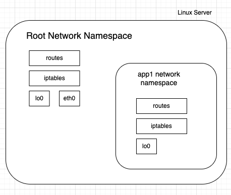
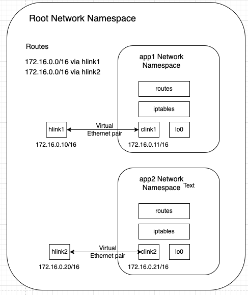
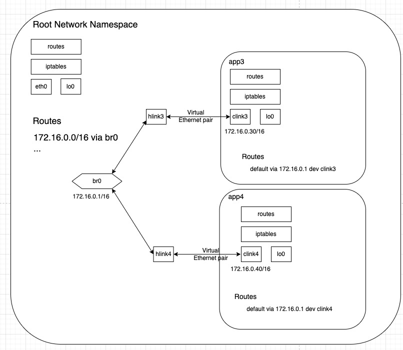

---

authors:
- Sara Qasmi
title: Diving deep into Container Networking: An Exploration of Linux Network Namespace
date: 
tags:
- Networking
- Container
- Linux
- Bridge
featureImage: bridge.png
series:
- Networking

draft: true
---

# Introduction

Container networking might seem complex and almost mystical initially, but it's actually built on basic Linux networking principles. By understanding these fundamentals, we can troubleshoot the container networking layers on a profound level. Furthermore, we might even dabble to creating container networking solution from scratch for pure enjoyment.

# Requirements 

- Ubuntu 22.04

# Dive Into The Foundations of Container Networking

A container is essentially an isolated and restricted Linux process within its own networking context that is completely separate from both the host system and other containers.

At the heart of this isolation lies a fascinating Linux kernel feature known as network namespaces. According to the man page, "network namespace is logically another copy of the network stack, with its own routes, firewall rules, and network devices.". 

Essentially, it allows processes to operate within their own distinct network environment, including having their own network interfaces, routing tables, and firewall configurations.

This capability of Linux kernel is empowering containerization technologies such as Docker to provide isolated networking environments for containers. 

By placing containers within their own network namespaces, they gain autonomy over their network configurations and ensures that containers can communicate with each other or the external network without causing interference with other containers or the host system's network setup (root namespace).


Understanding container networking and the utilization of network namespaces requires familiarity with the key components of a network stack:

1. **Network Devices**: These are the physical or virtual devices that facilitate communication within a network. You can list these devices using the command `ip link list`.

2. **Route Table**: Viewable with `ip route list`, is vital for routing packets from a source to a destination across networks. It stores information about available routes to various destinations within the network.

3. **iptables Rules**: With `iptables --list-rules`, you can manage packet filtering rules. These rules, organized into chains, determine the actions to be taken for packets based on specific criteria as they traverse through the network stack. The three built-in chains are:

   - **INPUT**: Used for packets destined for the local system.
   - **FORWARD**: Used for packets passing through the system.
   - **OUTPUT**: Used for packets originating from the local system.


# Inspect the Network Environment

Now lets apply what we learned before and inspect the network environement before running containers.

Network devices:

```
root@ubuntu:~# ip link show 
1: lo: <LOOPBACK,UP,LOWER_UP> mtu 65536 qdisc noqueue state UNKNOWN mode DEFAULT group default qlen 1000
    link/loopback 00:00:00:00:00:00 brd 00:00:00:00:00:00
2: enp0s1: <BROADCAST,MULTICAST,UP,LOWER_UP> mtu 1500 qdisc fq_codel state UP mode DEFAULT group default qlen 1000
    link/ether 06:c5:4b:b4:32:aa brd ff:ff:ff:ff:ff:ff

```

Routing table:

```
root@ubuntu:~# ip route list 
default via 192.168.64.1 dev enp0s1 proto dhcp src 192.168.64.3 metric 100 
192.168.64.0/24 dev enp0s1 proto kernel scope link src 192.168.64.3 metric 100 
192.168.64.1 dev enp0s1 proto dhcp scope link src 192.168.64.3 metric 100 
```

iptable rules:

```
root@ubuntu:~# iptables --list-rules
-P INPUT ACCEPT
-P FORWARD DROP
-P OUTPUT ACCEPT
-N DOCKER
-N DOCKER-ISOLATION-STAGE-1
-N DOCKER-ISOLATION-STAGE-2
-N DOCKER-USER
...
```

PS: If Docker is running on your host system, you will notice some custom chains added to your iptables rules. You can also create your own custom chain using the command `iptables --new-chain my-new-rule`.

# Managing Network Namespace 

Linux offers various tools and utilities for network namespace management. The `ip netns` command facilitates the creation, deletion, and administration of network namespaces.

Create a new networlk namespace:

```
root@ubuntu:~# ip netns add app1
```

To display the network namespaces that have been created, you can use the following command:

```
root@ubuntu:~# ip netns list
app1
```

To execute a process within a network namespace, you can utilize the `netenter` utility. Here's how you can initiate a new shell within the `app1` namespace:

```
root@ubuntu:~# nsenter --net=/run/netns/app1 bash
```

Now that we've created a Bash process in the `app1` namespace, we can execute our commands within the network namespace.

```
root@ubuntu:~# ip link list
1: lo: <LOOPBACK> mtu 65536 qdisc noop state DOWN mode DEFAULT group default qlen 1000
    link/loopback 00:00:00:00:00:00 brd 00:00:00:00:00:00


root@ubuntu:~# ip route list


root@ubuntu:~# iptables --list-rules
-P INPUT ACCEPT
-P FORWARD ACCEPT
-P OUTPUT ACCEPT
```

This output indicates that the Bash process is operating within a fully isolated namespace (app1). There are no routing rules or custom iptables chains present, and only one network device, the loopback interface, is available.



## Connecting Network Namespace to Host

Remember, network namespaces are isolated from each other and from the host. Now, let's establish a connection between the container's network namespace and the host.

To accomplish this, we'll use virtual Ethernet devices (veth). A veth device is a type of virtual network interface in Linux, creating a virtual network link between two network namespaces or between a network namespace and the host system.

Here's how it works:

A veth device is typically configured as a pair of virtual network interfaces. One end of the pair resides within the container's network namespace, while the other end is situated either in another network namespace or directly within the host system.

Open a new shell session to access the root network namespace:

```
root@ubuntu:~# ip link add hlink1 type veth peer name clink1
root@ubuntu:~# ip link list 
1: lo: <LOOPBACK,UP,LOWER_UP> mtu 65536 qdisc noqueue state UNKNOWN mode DEFAULT group default qlen 1000
    link/loopback 00:00:00:00:00:00 brd 00:00:00:00:00:00
2: enp0s1: <BROADCAST,MULTICAST,UP,LOWER_UP> mtu 1500 qdisc fq_codel state UP mode DEFAULT group default qlen 1000
    link/ether 06:c5:4b:b4:32:aa brd ff:ff:ff:ff:ff:ff
...
9: clink1@hlink1: <BROADCAST,MULTICAST,M-DOWN> mtu 1500 qdisc noop state DOWN mode DEFAULT group default qlen 1000
    link/ether a2:08:37:6f:7a:b2 brd ff:ff:ff:ff:ff:ff
10: hlink1@clink1: <BROADCAST,MULTICAST,M-DOWN> mtu 1500 qdisc noop state DOWN mode DEFAULT group default qlen 1000
    link/ether b2:2d:19:e8:a0:28 brd ff:ff:ff:ff:ff:ff
```

Both `hlink1`  and `clink1` are located within the root network namespace. To establish a connection between the root network namespace and the `app1` network namespace, we must retain one of the devices `hlink1` in the root namespace while relocating the other into the `app1` namespace.

```
root@ubuntu:~# ip link set clink1 netns app1
root@ubuntu:~# ip link list 
1: lo: <LOOPBACK,UP,LOWER_UP> mtu 65536 qdisc noqueue state UNKNOWN mode DEFAULT group default qlen 1000
    link/loopback 00:00:00:00:00:00 brd 00:00:00:00:00:00
2: enp0s1: <BROADCAST,MULTICAST,UP,LOWER_UP> mtu 1500 qdisc fq_codel state UP mode DEFAULT group default qlen 1000
    link/ether 06:c5:4b:b4:32:aa brd ff:ff:ff:ff:ff:ff
...
10: hlink1@if9: <BROADCAST,MULTICAST> mtu 1500 qdisc noop state DOWN mode DEFAULT group default qlen 1000
    link/ether b2:2d:19:e8:a0:28 brd ff:ff:ff:ff:ff:ff link-netns app1
```

The network device `clink1` has been relocated from the root network namespace to `app1` (notice the addition of `link-netns app1` binding to the `hlink1` device in the root network namespace). Let's switch to the shell session within the `app1` network namespace (or alternatively, you can use `nsenter --net=/run/netns/app1 bash`).

```
root@ubuntu:~# ip link list
1: lo: <LOOPBACK> mtu 65536 qdisc noop state DOWN mode DEFAULT group default qlen 1000
    link/loopback 00:00:00:00:00:00 brd 00:00:00:00:00:00
9: clink1@if10: <BROADCAST,MULTICAST> mtu 1500 qdisc noop state DOWN mode DEFAULT group default qlen 1000
    link/ether a2:08:37:6f:7a:b2 brd ff:ff:ff:ff:ff:ff link-netnsid 0
```

PS: keep in mind that both interfaces, `clink1` and `lo`, in `app1` network namespace are `DOWN`.

Now, we'll establish the link between both network devices, `hlink1` and `clink1` and assign appropriate IP addresses.

Stay in `app1` network namespace and run:

```
ip link set clink1 up
ip addr add 172.16.0.11/16 dev clink1
```

Check the config:

```
root@ubuntu:~# ip addr show dev clink1
9: clink1@if10: <NO-CARRIER,BROADCAST,MULTICAST,UP> mtu 1500 qdisc noqueue state LOWERLAYERDOWN group default qlen 1000
    link/ether a2:08:37:6f:7a:b2 brd ff:ff:ff:ff:ff:ff link-netnsid 0
    inet 172.16.0.11/16 scope global clink1
       valid_lft forever preferred_lft forever
```

we need also to setup the loopback interface (It is a virtual network interface that allows communication between applications running on the same network namespace. It is often identified by the IP address 127.0.0.1 and the hostname localhost)

```
ip link set lo up 
```

Now exit `app1` and lets go back to the root network namespace and setup the `hlink1` interface there:

```
ip link set hlink1 up
ip addr add 172.16.0.10/16 dev hlink1
```

Check the config:

```
root@ubuntu:~# ip addr show dev hlink1
10: hlink1@if9: <BROADCAST,MULTICAST> mtu 1500 qdisc noop state DOWN group default qlen 1000
    link/ether b2:2d:19:e8:a0:28 brd ff:ff:ff:ff:ff:ff link-netns app1
    inet 172.16.0.10/16 scope global hlink1
       valid_lft forever preferred_lft forever

```


Check now routing tables in `app1` network namespaces.

```
root@ubuntu:~# nsenter --net=/run/netns/app1 ip route
172.16.0.0/16 dev clink1 proto kernel scope link src 172.16.0.11
```

Then the routing table in the root network namespace.

```
root@ubuntu:~# ip route
default via 192.168.64.1 dev enp0s1 proto dhcp src 192.168.64.3 metric 100 
172.16.0.0/16 dev hlink1 proto kernel scope link src 172.16.0.10 
192.168.64.0/24 dev enp0s1 proto kernel scope link src 192.168.64.3 metric 100 
192.168.64.1 dev enp0s1 proto dhcp scope link src 192.168.64.3 metric 100 
```

In both namespaces, we observe a route connecting both interfaces, `hlink1` and `clink1`.

Let's start our first connectivity test by pinging `hlink1` from the `app1` network namespace.

```
root@ubuntu:~# nsenter --net=/run/netns/app1 ping 172.16.0.10
PING 172.16.0.10 (172.16.0.10) 56(84) bytes of data.
64 bytes from 172.16.0.10: icmp_seq=1 ttl=64 time=0.224 ms
64 bytes from 172.16.0.10: icmp_seq=2 ttl=64 time=0.045 ms
```

And now, `clink1` from the root network namespace.

```
root@ubuntu:~# ping 172.16.0.11
PING 172.16.0.11 (172.16.0.11) 56(84) bytes of data.
64 bytes from 172.16.0.11: icmp_seq=1 ttl=64 time=0.047 ms
64 bytes from 172.16.0.11: icmp_seq=2 ttl=64 time=0.060 ms
```

The connectivity test has been successful between root network namespace and `app1`.

# Connecting multiple Network Namespaces

Now lets try to access an other ip from `app1` network namespace.

```
root@ubuntu:~# ip addr show
1: lo: <LOOPBACK,UP,LOWER_UP> mtu 65536 qdisc noqueue state UNKNOWN group default qlen 1000
    link/loopback 00:00:00:00:00:00 brd 00:00:00:00:00:00
    inet 127.0.0.1/8 scope host lo
       valid_lft forever preferred_lft forever
    inet6 ::1/128 scope host 
       valid_lft forever preferred_lft forever
2: enp0s1: <BROADCAST,MULTICAST,UP,LOWER_UP> mtu 1500 qdisc fq_codel state UP group default qlen 1000
    link/ether 06:c5:4b:b4:32:aa brd ff:ff:ff:ff:ff:ff
    inet 192.168.64.3/24 metric 100 brd 192.168.64.255 scope global dynamic enp0s1
       valid_lft 84628sec preferred_lft 84628sec
    inet6 fd27:dbdd:63f5:8259:4c5:4bff:feb4:32aa/64 scope global dynamic mngtmpaddr noprefixroute 
       valid_lft 2591908sec preferred_lft 604708sec
    inet6 fe80::4c5:4bff:feb4:32aa/64 scope link 
       valid_lft forever preferred_lft forever
...
```

I am going to use 192.168.64.3.

```
root@ubuntu:~# nsenter --net=/run/netns/app1 ping 192.168.64.3
ping: connect: Network is unreachable
```

As you noticed in the previous explanations, the routing table of the `app1` network namespace contains only one route, which directs traffic for the network 172.16.0.0/16 through the `clink1` interface.

lets create a second network namespace `app2`:

```
ip netns add app2
ip link add hlink2 type veth peer name clink2
ip link set hlink2 up
ip addr add 172.16.0.20/16 dev hlink2
ip link set clink2 netns app2
```

Now connect to the `app2` network namespace.

```
nsenter --net=/run/netns/app2 bash
```

Then run:

```
ip link set lo up
ip link set clink2 up
ip addr add 172.16.0.21/16 dev clink2
```

Check the app2 routing table.

```
root@ubuntu:~# nsenter --net=/run/netns/app2 ip route 
172.16.0.0/16 dev clink2 proto kernel scope link src 172.16.0.21 
```

Now, lets run the connectifity test in `app2` to access the root network namespace.

```
root@ubuntu:~# nsenter --net=/run/netns/app2 ping 172.16.0.20
PING 172.16.0.20 (172.16.0.20) 56(84) bytes of data.

--- 172.16.0.20 ping statistics ---
2 packets transmitted, 0 received, 100% packet loss, time 1023ms

```

The connectivity test reveals that we are unable to access `hlink2` from `app2`, despite having a rule in the routing table of the `app2` namespace: 172.16.0.0/16 dev clink2 proto kernel scope link src 172.16.0.21.

We can also check it by running tcpdump in `hlink2` interface in the root network namespace.

```
tcpdump -i hlink2 icmp
```

At the same time, from the first container `app1` we can reach the host's end of the new container `hlink2`:

```
root@ubuntu:~# nsenter --net=/run/netns/app1 ping 172.16.0.20
PING 172.16.0.20 (172.16.0.20) 56(84) bytes of data.
64 bytes from 172.16.0.20: icmp_seq=1 ttl=64 time=0.111 ms
64 bytes from 172.16.0.20: icmp_seq=2 ttl=64 time=0.067 ms
```

But not `clink2`.

```
root@ubuntu:~# nsenter --net=/run/netns/app1 ping -c 2 172.16.0.21
PING 172.16.0.21 (172.16.0.21) 56(84) bytes of data.

--- 172.16.0.21 ping statistics ---
2 packets transmitted, 0 received, 100% packet loss, time 1003ms
```

Since both containers (app1 and app2) reside in the same IP network 172.16.0.0/16, we can talk to the host's hlink2 from the app1 container.

Let's inspect the routing table in the root namespace:

```
root@ubuntu:~# ip route
...
172.16.0.0/16 dev hlink1 proto kernel scope link src 172.16.0.10 
172.16.0.0/16 dev hlink2 proto kernel scope link src 172.16.0.20 
...
```

We're having a conflict in the routing table of the root network namespace. After adding the second veth pair, the root's routing table acquired a new route: 172.16.0.0/16 dev hlink2 proto kernel scope link src 172.16.0.20. However, there already existed an identical route for the 172.16.0.0/16 network. When app2 attempts to ping the hlink2 device, the first route is selected, resulting a connectivity issues.



# Connecting Network Namespaces using Bridge Network

The previous issue pushed us to explore alternatives for interconnecting containers, leading us to the Linux feature known as Linux Bridge. Operating similarly to a network switch, a Linux bridge facilitates packet forwarding between connected interfaces at the L2 level 

In the container ecosystem, the bridge acts as a virtual networking interface, linking containers through virtual Ethernet pairs. Each container is equipped with its own veth pair, with one end attached to the bridge network. This setup facilitates internal communication between containers and with the host system.


Let's create new namespaces. Go to the root network namespace.

```
ip netns add app3
ip link add hlink3 type veth peer name clink3
ip link set hlink3 up
ip link set clink3 netns app3
```

```
nsenter --net=/run/netns/app3 bash
```

```
ip link set lo up
ip link set clink3 up
ip addr add 172.16.0.30/16 dev clink3
ip link
```

Exit `app3` network namespace.

```
exit
```

Create `app4` network namespace.

```
ip netns add app4
ip link add hlink4 type veth peer name clink4
ip link set hlink4 up
ip link set clink4 netns app4
ip link
```

```
nsenter --net=/run/netns/app4 bash
```

```
ip link set lo up
ip link set clink4 up
ip addr add 172.16.0.40/16 dev clink4
ip link
```

Exit `app4` namespace.

```
exit
```

Make sure that there is no new routes added to the routing table of the root namespace:

```
root@ubuntu:~# ip route 
default via 192.168.64.1 dev enp0s1 proto dhcp src 192.168.64.3 metric 100 
192.168.64.0/24 dev enp0s1 proto kernel scope link src 192.168.64.3 metric 100 
192.168.64.1 dev enp0s1 proto dhcp scope link src 192.168.64.3 metric 100 
```

Now, let's create the bridge device and connect `hlink3` and `hlink4` to it to ensure connectivity between the containers. Go to the root network namespace.

```
ip link add br0 type bridge 
ip link set br0 up
ip link set hlink3 master br0
ip link set hlink4 master br0
ip link
```



# Connectivity Test

PS: if you are running docker in your host, make sure to remove br_netfilter kernel module `rmmod br_netfilter` (for more details https://unix.stackexchange.com/questions/671644/cant-establish-communication-between-two-network-namespaces-using-bridge-networ)

Before the ping test, ensure to run tcpdump on the bridge interface to capture the ICMP traffic between both containers.

```
tcpdump -i br0 icmp
```

Now, switch to another session and execute the following commands:

```
root@ubuntu:~# nsenter --net=/run/netns/app3 ping -c 2 172.16.0.40
PING 172.16.0.40 (172.16.0.40) 56(84) bytes of data.
64 bytes from 172.16.0.40: icmp_seq=1 ttl=64 time=0.142 ms
64 bytes from 172.16.0.40: icmp_seq=2 ttl=64 time=0.071 ms

--- 172.16.0.40 ping statistics ---
2 packets transmitted, 2 received, 0% packet loss, time 1025ms
rtt min/avg/max/mdev = 0.071/0.106/0.142/0.035 ms
```

```
root@ubuntu:~# nsenter --net=/run/netns/app4 ping -c 2 172.16.0.30
PING 172.16.0.30 (172.16.0.30) 56(84) bytes of data.
64 bytes from 172.16.0.30: icmp_seq=1 ttl=64 time=0.053 ms
64 bytes from 172.16.0.30: icmp_seq=2 ttl=64 time=0.057 ms

--- 172.16.0.30 ping statistics ---
2 packets transmitted, 2 received, 0% packet loss, time 1028ms
rtt min/avg/max/mdev = 0.053/0.055/0.057/0.002 ms
```

We can see from the tcpdum command that the icmp traffic if going through brigde to reach each destination network namespace.

```
root@ubuntu:~# tcpdump -i br0 icmp
tcpdump: verbose output suppressed, use -v[v]... for full protocol decode
listening on br0, link-type EN10MB (Ethernet), snapshot length 262144 bytes
16:19:13.037613 IP 172.16.0.30 > 172.16.0.40: ICMP echo request, id 44793, seq 1, length 64
16:19:13.037626 IP 172.16.0.40 > 172.16.0.30: ICMP echo reply, id 44793, seq 1, length 64
16:19:14.062746 IP 172.16.0.30 > 172.16.0.40: ICMP echo request, id 44793, seq 2, length 64
16:19:14.062781 IP 172.16.0.40 > 172.16.0.30: ICMP echo reply, id 44793, seq 2, length 64
16:19:42.217807 IP 172.16.0.40 > 172.16.0.30: ICMP echo request, id 13480, seq 1, length 64
16:19:42.217839 IP 172.16.0.30 > 172.16.0.40: ICMP echo reply, id 13480, seq 1, length 64
16:19:43.245866 IP 172.16.0.40 > 172.16.0.30: ICMP echo request, id 13480, seq 2, length 64
16:19:43.245894 IP 172.16.0.30 > 172.16.0.40: ICMP echo reply, id 13480, seq 2, length 64
```

The test is successful !! Without configuring hlink3 and hlink4, we assigned IP addresses only to clink3 and clink4. Since they're on the same Ethernet segment (connected to the bridge) L2 connectivity is established. We can verify this also by checking the ARP table in both namespaces for the MAC addresses of each other.

```
root@ubuntu:~# nsenter --net=/run/netns/app3 arp -n
Address                  HWtype  HWaddress           Flags Mask            Iface
172.16.0.40              ether   52:45:d1:3a:b3:32   C                     clink3
```

```
root@ubuntu:~# nsenter --net=/run/netns/app4 arp -n
Address                  HWtype  HWaddress           Flags Mask            Iface
172.16.0.30              ether   82:6e:c9:b4:c0:79   C                     clink4
```

Also you can run.

```
root@ubuntu:~# nsenter --net=/run/netns/app3 ip neigh
172.16.0.40 dev clink3 lladdr 52:45:d1:3a:b3:32 REACHABLE
```

This command shows that the IP address 172.16.0.40 (app4) is reachable via the device `clink3` in the network namespace `app3`, with MAC address 52:45:d1:3a:b3:32.

```
root@ubuntu:~# nsenter --net=/run/netns/app4 ip neigh
172.16.0.30 dev clink4 lladdr 82:6e:c9:b4:c0:79 REACHABLE
```

Let's try to ping `app3` from the root network namespace.

```
root@ubuntu:~# ping -c 2 172.16.0.30
PING 172.16.0.30 (172.16.0.30) 56(84) bytes of data.
From 172.16.0.10 icmp_seq=1 Destination Host Unreachable
From 172.16.0.10 icmp_seq=2 Destination Host Unreachable

--- 172.16.0.30 ping statistics ---
2 packets transmitted, 0 received, +2 errors, 100% packet loss, time 1017ms
```

The root namespace cannot talk to containers. To establish the connectivity between the root and container namespaces, we need to assign the IP address to the bridge network interface.

```
ip addr add 172.16.0.1/16 dev br0
```

Once we assigned ip address to br0 we got a route in the host routing table: `172.16.0.0/16 dev br0 proto kernel scope link src 172.16.0.1`

Now we should be able to ping containers from the root network namespace.
```
root@ubuntu:~# ping -c 2 172.16.0.30
PING 172.16.0.30 (172.16.0.30) 56(84) bytes of data.
64 bytes from 172.16.0.30: icmp_seq=1 ttl=64 time=0.085 ms
64 bytes from 172.16.0.30: icmp_seq=2 ttl=64 time=0.069 ms

--- 172.16.0.30 ping statistics ---
2 packets transmitted, 2 received, 0% packet loss, time 1016ms
rtt min/avg/max/mdev = 0.069/0.077/0.085/0.008 ms
```

In the container's side we shoud add a default route to the bridge interface.

```
root@ubuntu:~# nsenter --net=/run/netns/app3  ip route add default via 172.16.0.1
root@ubuntu:~# nsenter --net=/run/netns/app4  ip route add default via 172.16.0.1
```

Now, `app3` and `app4` can reach any network interfaces in the root network namespace.

```
root@ubuntu:~# nsenter --net=/run/netns/app3  ping -c 2 192.168.64.3
PING 192.168.64.3 (192.168.64.3) 56(84) bytes of data.
64 bytes from 192.168.64.3: icmp_seq=1 ttl=64 time=0.184 ms
64 bytes from 192.168.64.3: icmp_seq=2 ttl=64 time=0.066 ms

--- 192.168.64.3 ping statistics ---
2 packets transmitted, 2 received, 0% packet loss, time 1019ms
rtt min/avg/max/mdev = 0.066/0.125/0.184/0.059 ms
```

Great! We can go from the containers to the host and back.

# Containers-to-Internet Connectivity

Now, let's connect the containers to the outside world. By default, packet forwarding is disabled in Linux. We must enable it (from the root namespace). This transforms the host machine into a router, with the bridge interface serving as the default gateway for the containers.

```
echo 1 > /proc/sys/net/ipv4/ip_forward
```

The destination server can not send packets back to the container due to its private IP address. To address this issue, the common approach is to use Network Address Translation (NAT). 

Before reaching the external network, packets originating from the containers will have their source IP addresses replaced with the host's external interface address. Additionally, the host will track all existing mappings and, upon arrival, restore the IP addresses before forwarding packets back to the containers. To enable this:

```
iptables -t nat -A POSTROUTING -s 172.16.0.0/16 ! -o br0 -j MASQUERADE
```

This iptables rule performs NAT (Network Address Translation) for outgoing packets from the 172.16.0.0/16 subnet, excluding those destined for the "br0" interface. It dynamically translates the source IP addresses of these packets to the IP address of the interface they are being sent through, allowing internal IPs to be hidden behind a single public IP.

Checking the connectivity again:

```
root@ubuntu:~# nsenter --net=/run/netns/app4 ping -c 2 8.8.8.8
PING 8.8.8.8 (8.8.8.8) 56(84) bytes of data.
64 bytes from 8.8.8.8: icmp_seq=1 ttl=115 time=9.29 ms
64 bytes from 8.8.8.8: icmp_seq=2 ttl=115 time=7.72 ms
```


# Conclusion

Understanding Linux networking features is fundamental to many containerization technologies. This foundational knowledge serves as a basis for comprehending higher-level networking concepts used in Kubernetes. In our upcoming article, we'll delve into how Container Runtime Interface (CRI) and Container Network Interface (CNI) leverage these features within the Kubernetes ecosystem.

Check our labs here https://github.com/fence-io/playground?tab=readme-ov-file#available-labs